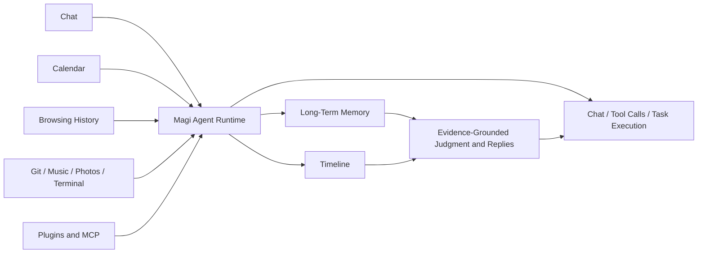

  

<h1 align="center">Magi</h1>

  <em>A local AI companion that remembers you</em>

  
  
  
  
  

  Language: English | <a href="./README.zh-CN.md">简体中文</a>

---

  

Magi is first and foremost an **agent runtime** that runs on your local desktop: it can chat, call tools, execute tasks, handle interruptions and permission requests, and move long-running work into the background.

What makes it different is not simply that it can run tasks. It is **not a one-shot agent**. Magi remembers the keyboard you complained about last time, the project you have been working on all week, and the song you looped three times last night. It turns those fragments from conversations, calendars, browsing history, git commits, music, and photos into a personal timeline you can revisit, question, correct, and delete, so the agent's judgment stays grounded in memory that accumulates over time.

## Why Magi

Magi was not designed to rebuild Claude Code or OpenClaw.

If many AI agents focus on the question, "How can this task be completed faster and better?", Magi wants to answer a different one: **can an agent keep working over the long term**, across repeated conversations, daily activity, and a life that keeps changing, while continuing to understand you and make better judgments from that context?

This kind of observation is not surveillance, and it is not about piling data into a dashboard. Within the boundaries you authorize, Magi takes fragments from conversations, calendars, browsing history, git commits, music, photos, screen time, and terminal commands, then organizes them into a timeline you can revisit and turns them into long-term memory you can inspect, correct, and delete.

- 🤖 **The agent is the core capability; memory makes the agent stronger** - Magi can chat, call tools, execute tasks, and keep running, rather than stopping at being a chat UI that merely remembers things.
- 🧠 **Real long-term memory is not just a larger context window** - It reaches **87.2% accuracy** on LongMemEval, with a retrieval pipeline built for facts, preferences, cross-session patterns, and changes over time.
- 📅 **A timeline is not a chat log** - It organizes events from conversations and external data sources into a searchable, reviewable, askable personal timeline, and gives the agent traceable grounding.
- 🔍 **Memory is inspectable** - You can review what the AI remembers, correct wrong inferences, and delete anything you do not want to keep.
- 🏠 **Local-first** - App and runtime data stay on your own machine by default under `~/.magi`, and data is not proactively sent elsewhere outside LLM API calls.
- 🎭 **Persona is not just a system prompt** - Magi maintains persona profiles, relationship depth, and dynamic state so the agent's behavior, tone, and long-term interaction feel more continuous.

## How Magi Keeps An Agent Oriented Over Time

Magi is not about turning memory into an isolated module. It is about letting the agent build on continuously accumulated context while it executes tasks, chats with you, and keeps interacting over time.

You can think of it as a continuously running local system:

1. **It works as an agent first**: Magi chats, calls tools, executes tasks, and handles interruptions, permissions, and background work.
2. **Then it turns interactions into long-term context**: with your permission, conversations and external data sources are organized into a Timeline and Memory instead of dissolving into scattered logs.
3. **Later judgments are grounded in memory**: when it continues answering, planning, or executing tasks, it retrieves evidence from the timeline and long-term memory instead of guessing from the current window alone.

All data sources connect through one unified plugin architecture. Magi only sees what you authorize, and it forgets what you delete.

## Main Features

### 💬 Chat With Memory

  

Long conversations, local workspaces, managed attachments, and answers that can bring in long-term memory when it matters, instead of starting from a blank slate every time.

### 📜 Timeline

It organizes chat and plugin events into a searchable timeline, with natural-language queries and context drawers.

### 🧩 Memory Workbench

L0 working state, L1 events, L2 structured cognition, L3 reflections, and L4 procedural skills. Every layer can be inspected, corrected, and cleared.

### 🎭 Persona And Natural Rhythm

Persona profiles, conversation modes, relationship depth, and dynamic state. Long replies can be split into multiple chat bubbles so the interaction feels more like an ongoing exchange than a one-off report.

### 🎮 Tasks And Run Control

Treat conversations as controllable agent runs. You can interrupt them, steer them, handle permission requests, or move long jobs into the background.

### 🔌 Plugin Marketplace And External Capabilities

Install, enable, and configure official or third-party plugins. MCP servers and channels such as Telegram can also plug into the same runtime.

One clarification: Magi uses a unified plugin architecture, but the marketplace registry and most installable official or third-party plugins currently live in the companion repository [magi-plugins](https://github.com/asukaonly/magi-plugins). This repository mainly contains the desktop app, agent runtime, gateway, frontend, backend, and the plugin platform itself, so it is normal not to find every plugin implementation here.

## Privacy And Data

Magi is designed to be local-first:

- **Application data stays local**: on macOS/Linux it lives under `~/.magi/`; on Windows under `%USERPROFILE%\.magi`
- **Data is only sent out during LLM calls**: your chat content and retrieved context are sent as needed to the model providers you configure, such as OpenAI, Anthropic, or local Ollama
- **Permission tiers**: tool execution supports permission levels, and sensitive actions such as file writes, commits, or pushes require confirmation
- **Memory can be deleted**: all stored memories can be reviewed and cleared from the memory workbench

If you want to fully wipe Magi data, deleting the directory above is enough.

## Benchmark

The current long-term memory and retrieval pipeline reaches **87.2% accuracy** on LongMemEval:

| LongMemEval category | Accuracy | Count |
| -------------------- | -------: | ----: |
| **Overall**          | **0.8720** | **-** |
| Multi-session        |   0.7444 |   133 |
| Single-session assistant | 1.0000 |    56 |
| Temporal reasoning   |   0.8947 |   133 |
| Knowledge update     |   0.8974 |    78 |
| Single-session preference | 0.8667 |    30 |
| Single-session user  |   0.9429 |    70 |

For reproduction steps, model configuration, and raw outputs, see [`benchmark/README.md`](./benchmark/README.md).

## Install

Magi is distributed as a packaged desktop application. End users do not need to install Python, Node.js, or Rust.

1. Open [GitHub Releases](https://github.com/asukaonly/magi/releases)
2. Download the latest installer for your platform:
   - **macOS Apple Silicon**: `Magi_aarch64.dmg`
   - **macOS Intel**: `Magi_x64.dmg`
   - **Windows**: `Magi_<version>_x64-setup.exe`
3. Install and launch Magi
4. Complete onboarding for language, model/provider setup, and basic preferences

## Beta Notes

Magi is still moving quickly. Expect rough edges:

- Interfaces and data schemas may continue to change, so check release notes before upgrading
- Some plugins are still being polished, and third-party MCP compatibility is still improving
- Feedback is welcome in [Issues](https://github.com/asukaonly/magi/issues) or [Discussions](https://github.com/asukaonly/magi/discussions)

## Documentation

- [Documentation Index](./docs/README.md)
- [Project Overview](./docs/project-overview.md)
- [Product Configuration Guide](./docs/product-configuration-guide.md)
- [Task-Agent Runtime Architecture](./docs/task-agent-runtime-architecture.md)
- [Unified Plugin Architecture](./docs/plugin-extension-architecture.md)
- [Plugin Development Guide](./docs/plugin-development-guide.md)
- [Memory System Design](./docs/memory-system-design.md)

## Contributing

Issues and Pull Requests are welcome. For development environment setup, build commands, and repository structure, see [CONTRIBUTING.md](./CONTRIBUTING.md).
If you want to contribute a new external plugin, you will usually want the companion repository [magi-plugins](https://github.com/asukaonly/magi-plugins).

## About The Name

`Magi` comes from the intelligent computer system in `EVA`, and can also be read as `My Agent Gets It` - not because it always knows the answer, but because it is willing to keep getting to know you.

## License

[MIT](./LICENSE)
