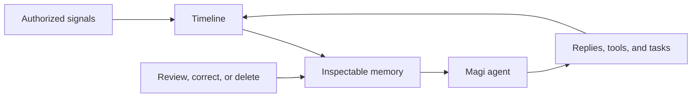

  

<h1 align="center">Magi</h1>

  <em>Turn time into context</em>

  
  
  
  
  

  Language: English | <a href="./README.zh-CN.md">简体中文</a>

---

  

Magi is a local-first desktop agent for work that does not fit inside one chat window.

It can chat, use tools, run background tasks, and remember useful context over time. With your permission, Magi connects conversations, calendars, browsing history, git activity, music, photos, and other local signals into a timeline you can search, question, correct, and clear.

## Beyond a Single Chat

The awkward part of most AI tools is what happens after the first answer.

You come back to the same project next week. You change your mind about a preference. You correct something the model guessed wrong. A habit only becomes visible after it repeats a few times. Magi is built for that in-between space: what happened before, what changed, what still matters, and what should no longer be used.

- **It can keep working** - Magi can answer, use tools, ask for permission, recover from interruptions, and move long-running work into the background.
- **Memory has evidence** - Stored context is tied back to conversations and authorized local sources, so you can inspect where it came from.
- **The timeline comes first** - Events are kept as a history you can search and revisit before they become long-term memory.
- **You can correct the record** - Weak inferences can be edited or removed; unwanted memories can be deleted.
- **Local by default** - App and runtime data stay under `~/.magi`; data only leaves during model calls or actions you configure.
- **It does not reset every turn** - Persona profiles, relationship depth, and natural reply rhythm help Magi feel less like a stateless command box.

## From Timeline to Memory

Magi keeps the order simple: preserve what happened first, then distill what is worth carrying forward. That makes memory reviewable instead of magical.

The flow is simple:

1. **Signals become a timeline**: conversations and authorized plugin events are normalized into a history you can search and revisit.
2. **The timeline becomes memory**: useful facts, patterns, experiences, and corrections are distilled into long-term context.
3. **Memory guides future work**: when Magi replies, plans, or executes tasks, it can retrieve relevant context instead of relying only on the current window.
4. **You stay in control**: memory is not a black box; you can review, edit, delete, and clear it.

All data sources connect through one unified plugin architecture. Magi only sees what you authorize, and it forgets what you delete.

## Main Features

### Chat With Long-Term Context

Chat across local workspaces, managed attachments, tools, and long-term memory. Magi can bring in relevant context when it matters instead of starting from a blank slate every time.

View screenshot

  

### Timeline

Turn conversations and authorized plugin events into a searchable personal timeline, with natural-language queries and context drawers for source details.

### Inspectable Memory

Review what Magi has remembered, see where it came from, correct weak inferences, and remove memories you do not want to keep.

View screenshots

  

  

### Persona And Natural Rhythm

Persona profiles, conversation modes, relationship depth, and dynamic state. Long replies can be split into multiple chat bubbles so the interaction feels more like an ongoing exchange than a one-off report.

View screenshot

  

### Tasks And Run Control

Run one-off or scheduled agent work with visible status. You can interrupt runs, steer them, handle permission requests, or move long jobs into the background.

View screenshots

  

  

### Plugins And External Capabilities

Install, enable, and configure plugins for local data sources, tools, and external channels. MCP servers and channels such as Telegram can plug into the same runtime.

Most installable plugins live in the companion repository [magi-plugins](https://github.com/asukaonly/magi-plugins). This repository contains the desktop app, agent runtime, gateway, frontend, backend, and plugin platform.

View screenshot

  

## Privacy And Data

Magi is designed to be local-first:

- **Application data stays local**: on macOS/Linux it lives under `~/.magi/`; on Windows under `%USERPROFILE%\.magi`
- **Data is only sent out during LLM calls**: your chat content and retrieved context are sent as needed to the model providers you configure, such as OpenAI, Anthropic, or local Ollama
- **Permission tiers**: tool execution supports permission levels, and sensitive actions such as file writes, commits, or pushes require confirmation
- **Powerful local tools are explicit**: built-in tools can read and write files, run shell commands, fetch public web pages, search the web, and call configured external services. File reads inside the active workspace stay low-friction; reads outside the workspace are permission-gated, with sensitive user paths treated as higher risk. Web fetch blocks localhost/private-network targets unless the user explicitly enables private-network fetch and allowlists trusted hosts/IP ranges. Disable tools you do not want Magi to use, and review permission prompts before allowing sensitive actions.
- **Network tools use configured providers**: weather uses keyless Open-Meteo by default with QWeather available for users who prefer it, while web search defaults to keyless DuckDuckGo and can use Brave, Tavily, Perplexity, or a user-hosted SearXNG instance when configured. Search and fetch results are cached briefly in memory to reduce duplicate requests. DuckDuckGo availability depends on the user's network and anti-bot checks; app network proxy settings are opt-in.
- **Memory can be deleted**: all stored memories can be reviewed and cleared from the memory workbench

If you want to fully wipe Magi data, deleting the directory above is enough.

## Benchmark

The current long-term memory and retrieval pipeline reaches **87.2% accuracy** on LongMemEval:

| LongMemEval category | Accuracy | Count |
| -------------------- | -------: | ----: |
| **Overall**          | **0.8720** | **500** |
| Multi-session        |   0.8271 |   133 |
| Single-session assistant | 0.9286 |    56 |
| Temporal reasoning   |   0.8647 |   133 |
| Knowledge update     |   0.9231 |    78 |
| Single-session preference | 0.6000 |    30 |
| Single-session user  |   0.9857 |    70 |

Scored on LongMemEval `_s` (500 questions) with an LLM judge (`glm-5`); a second judge (`bailian`) independently scores 87.6%. Raw predictions, per-question judge verdicts, and reproduction steps: [`benchmark/longmemeval/results/v0.1.2/`](./benchmark/longmemeval/results/v0.1.2/RESULTS.md). For the runner and model configuration, see [`benchmark/README.md`](./benchmark/README.md).

## Install

Magi is distributed as a packaged desktop application. End users do not need to install Python, Node.js, or Rust.

1. Open [GitHub Releases](https://github.com/asukaonly/magi/releases)
2. Download the latest installer for your platform:
   - **macOS Apple Silicon**: `Magi_aarch64.dmg`
   - **macOS Intel**: `Magi_x64.dmg`
   - **Windows**: `Magi_<version>_x64-setup.exe`
3. Install and launch Magi
4. Complete onboarding for language, model/provider setup, and basic preferences

## Beta Notes

Magi is still moving quickly. Expect rough edges:

- Interfaces and data schemas may continue to change, so check release notes before upgrading
- Some plugins are still being polished, and third-party MCP compatibility is still improving
- Feedback is welcome in [Issues](https://github.com/asukaonly/magi/issues) or [Discussions](https://github.com/asukaonly/magi/discussions)

## Documentation

- [Documentation Index](./docs/README.md)
- [Project Overview](./docs/project-overview.md)
- [Product Configuration Guide](./docs/product-configuration-guide.md)
- [Task-Agent Runtime Architecture](./docs/task-agent-runtime-architecture.md)
- [Unified Plugin Architecture](./docs/plugin-extension-architecture.md)
- [Plugin Development Guide](./docs/plugin-development-guide.md)
- [Memory System Design](./docs/memory-system-design.md)

## Contributing

Issues and Pull Requests are welcome. For development environment setup, build commands, and repository structure, see [CONTRIBUTING.md](./CONTRIBUTING.md).
If you want to contribute a new external plugin, you will usually want the companion repository [magi-plugins](https://github.com/asukaonly/magi-plugins).

## About The Name

`Magi` comes from the intelligent computer system in `EVA`, and can also be read as `My Agent Gets It` - not because it always knows the answer, but because it is willing to keep getting to know you.

## License

[MIT](./LICENSE)
