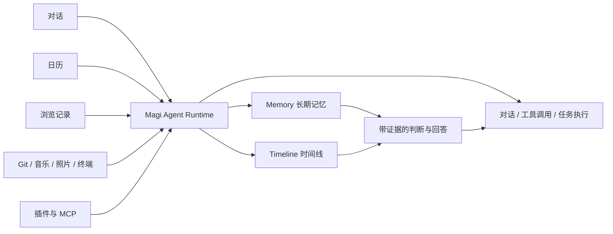

  

<h1 align="center">Magi</h1>

  <em>一个会记得你的本地 AI 伴侣</em>

  
  
  
  
  

  语言：简体中文 | <a href="./README.md">English</a>

---

  

Magi 首先是一个运行在你本地桌面上的 **Agent runtime**：它可以对话、调用工具、执行任务、处理中断与权限请求，也可以把长任务放到后台继续跑。

它的差异化不在于“再做一个能跑任务的 Agent”，而在于它**不是一次性工作的 Agent**。Magi 会记得你上次抱怨过的那把键盘、你这周一直在改的项目、你昨晚循环了三遍的歌，并把这些散落在对话、日历、浏览记录、Git 提交、音乐、照片里的片段，整理成一条**你可以回看、追问、修正、删除**的个人时间线，让 Agent 的判断建立在持续积累的记忆之上。

## 为什么是 Magi

Magi 的设计初衷并不是为了再造一个 Claude Code 或者 OpenClaw。

如果说很多 AI Agent 的核心问题是“怎样更快、更好地完成一项任务”，那么 Magi 想回答的是另一个问题：**能不能做一个真正长期工作的 Agent**，在一次次对话、一天天活动和不断变化的生活里，持续理解“你”、理解上下文，并据此做出更好的判断？

这里的观察不是监控，也不是把数据堆成报表。Magi 希望在你授权的范围内，把散落在对话、日历、浏览记录、Git 提交、音乐、照片、屏幕使用、终端命令里的生活片段，整理成一条可以回望的时间线，沉淀成可检查、可修正、可删除的长期记忆。

- 🤖 **Agent 是主能力，记忆让 Agent 变强** — Magi 能对话、调用工具、执行任务和持续运行，而不是停留在“会记事的聊天界面”
- 🧠 **真正的长期记忆，不是更长的上下文窗口** — 在 LongMemEval 上达到 **87.2% accuracy**，面向事实、偏好、跨会话模式和时间变化构建召回链路
- 📅 **时间线，不是聊天记录** — 把对话和外部数据源的事件组织成可搜索、可回看、可追问的个人时间线，并为 Agent 提供可追溯依据
- 🔍 **记忆是白盒的** — 你可以查看 AI 记住了什么，修正错误推断，删除不想保留的内容
- 🏠 **本地优先** — 应用与运行数据默认保存在你自己的机器上（`~/.magi`），LLM API 调用之外不主动外发数据
- 🎭 **人格不是一层 system prompt** — 维护人格档案、关系深度、动态状态，让 Agent 的行为、语气和长期互动更连续

## Magi 怎么让 Agent 持续理解你

Magi 的重点不是“把记忆单独做成一个模块”，而是让 Agent 在执行、对话和长期互动时，都能建立在持续积累的上下文之上。

你可以把它理解成一个持续运行的本地系统：

1. **先作为 Agent 工作**：Magi 会对话、调工具、执行任务，也会处理中断、权限和后台运行。
2. **再把互动沉淀成长期上下文**：在你授权的前提下，对话和外部数据源会被整理成 Timeline 与 Memory，而不是散成一堆日志。
3. **让后续判断建立在记忆上**：当它继续回答、规划或执行任务时，会从时间线和长期记忆里检索依据，而不是只靠当前窗口里的上下文猜。

所有数据源都通过统一的插件架构接入。你授权什么，Magi 才看什么；你删除什么，Magi 就忘记什么。

## 主要功能

### 💬 带记忆的对话

  

长对话、本地工作区、受管理附件，并能在合适的时候带着长期记忆回答——而不是每次从一片空白开始。

### 📜 时间线

把聊天和插件来源的事件组织成可搜索时间线，支持自然语言查询和上下文抽屉。

### 🧩 记忆工作台

L0 工作状态、L1 事件、L2 结构化认知、L3 反思、L4 程序性技能。每一层都可以检查、修正、清除。

### 🎭 人格与自然节奏

人格档案、对话模式、关系深度、动态状态。长回复会拆成多段聊天气泡，更像持续互动而不是一次性报告。

### 🎮 任务与运行控制

把对话视为可控制的 Agent run。可以打断、调整方向、处理权限请求，或把长任务移到后台继续执行。

### 🔌 插件市场与外部能力

安装/启用/配置官方或第三方插件。MCP 服务器和 Telegram 等渠道也可以接入同一个运行时。

## 隐私与数据

Magi 是本地优先设计：

- **应用数据保存在本地**：macOS/Linux 在 `~/.magi/`，Windows 在 `%USERPROFILE%\.magi`
- **数据外发只发生在 LLM 调用**：你的对话和检索上下文会按需发送给你配置的模型提供商（OpenAI / Anthropic / 本地 Ollama 等）
- **权限分级**：工具执行支持权限分级，敏感操作（文件写入、commit、push 等）需要确认
- **记忆可删除**：所有沉淀的记忆都可以在记忆工作台中查看和清除

需要彻底清除 Magi 数据时，删除上述目录即可。

## Benchmark

当前长期记忆与检索链路在 LongMemEval 上达到 **87.2% accuracy**：

| LongMemEval 分类          |   Accuracy |  数量 |
| ------------------------- | ---------: | ----: |
| **Overall**               | **0.8720** | **-** |
| Multi-session             |     0.7444 |   133 |
| Single-session assistant  |     1.0000 |    56 |
| Temporal reasoning        |     0.8947 |   133 |
| Knowledge update          |     0.8974 |    78 |
| Single-session preference |     0.8667 |    30 |
| Single-session user       |     0.9429 |    70 |

复现方法、模型配置和原始输出见 [`benchmark/README.md`](./benchmark/README.md)。

## 安装

Magi 以打包好的桌面应用交付。普通用户不需要安装 Python、Node.js 或 Rust。

1. 打开 [GitHub Releases](https://github.com/asukaonly/magi/releases)
2. 下载对应平台的最新安装包：
   - **macOS Apple Silicon**：`Magi_aarch64.dmg`
   - **macOS Intel**：`Magi_x64.dmg`
   - **Windows**：`Magi_<version>_x64-setup.exe`
3. 安装并启动 Magi
4. 完成语言、模型/提供商和基础偏好配置

## Beta 阶段说明

Magi 仍在快速迭代，请留意：

- 接口和数据 schema 可能继续调整，升级时建议关注 release notes
- 部分插件还在打磨，第三方 MCP 兼容性持续完善中
- 欢迎在 [Issues](https://github.com/asukaonly/magi/issues) 反馈问题，或在 [Discussions](https://github.com/asukaonly/magi/discussions) 参与讨论

## 文档

- [文档索引](./docs/README.md)
- [项目概览](./docs/project-overview.md)
- [产品配置指南](./docs/product-configuration-guide.md)
- [Task-Agent Runtime 架构](./docs/task-agent-runtime-architecture.md)
- [统一插件架构](./docs/plugin-extension-architecture.md)
- [插件开发指南](./docs/plugin-development-guide.md)
- [记忆系统设计](./docs/memory-system-design.md)

## 贡献

欢迎提交 Issue 和 Pull Request。开发环境搭建、构建命令和仓库结构请参考 [CONTRIBUTING.md](./CONTRIBUTING.md)。

## 关于名字

`Magi` 来自《EVA》中的智能电脑系统，也可以理解为 `My Agent Gets It`——不是因为它永远知道答案，而是因为它愿意持续地认识你。

## 许可证

[MIT](./LICENSE)