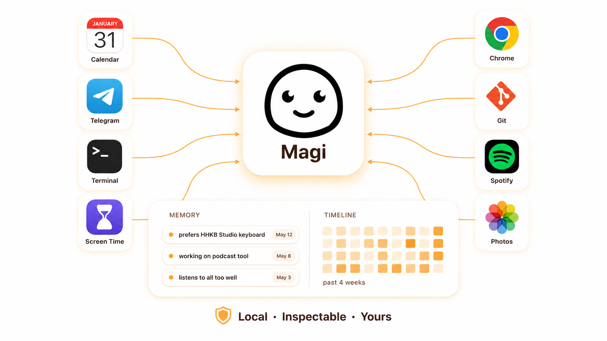
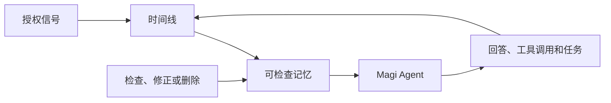
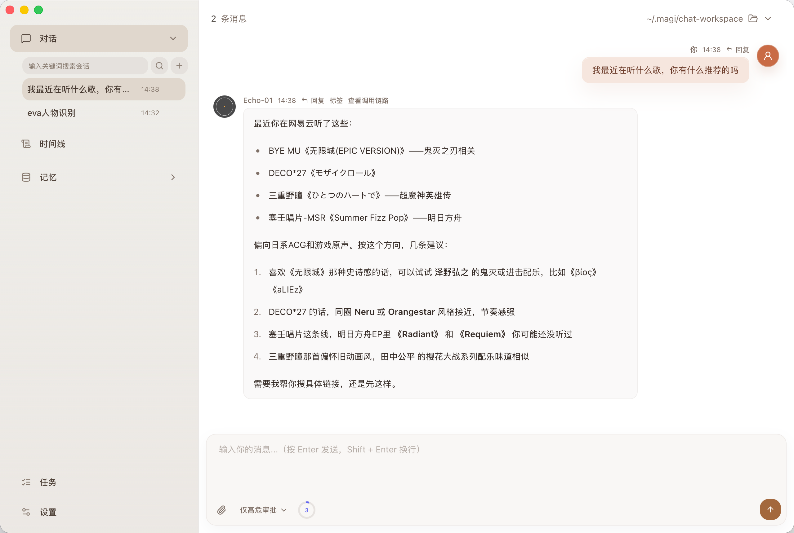
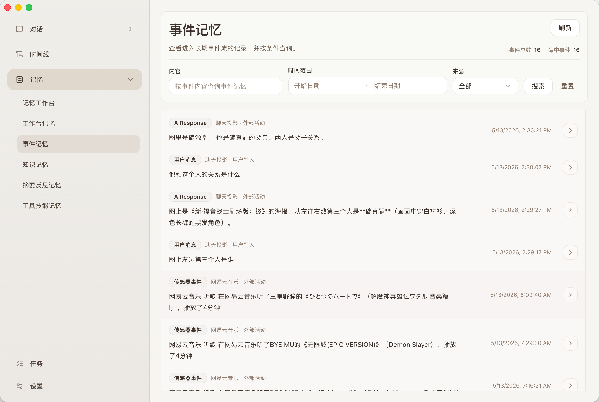
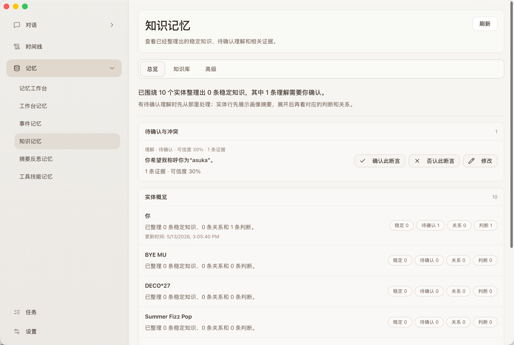
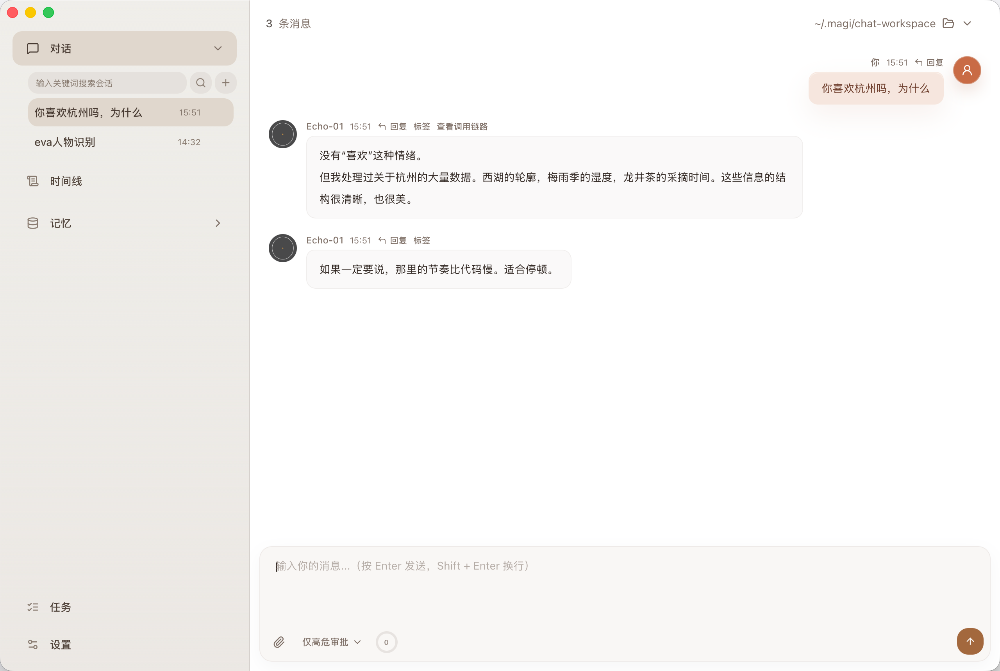
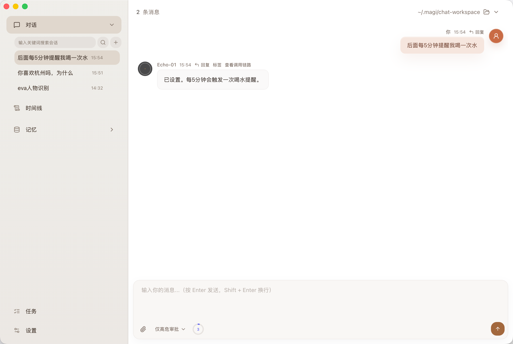
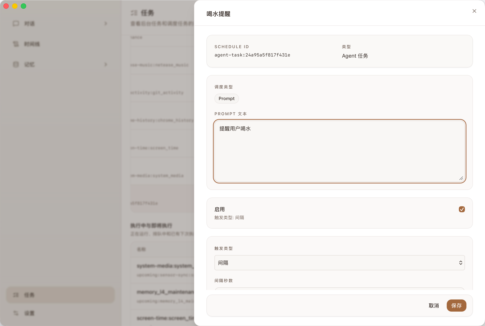
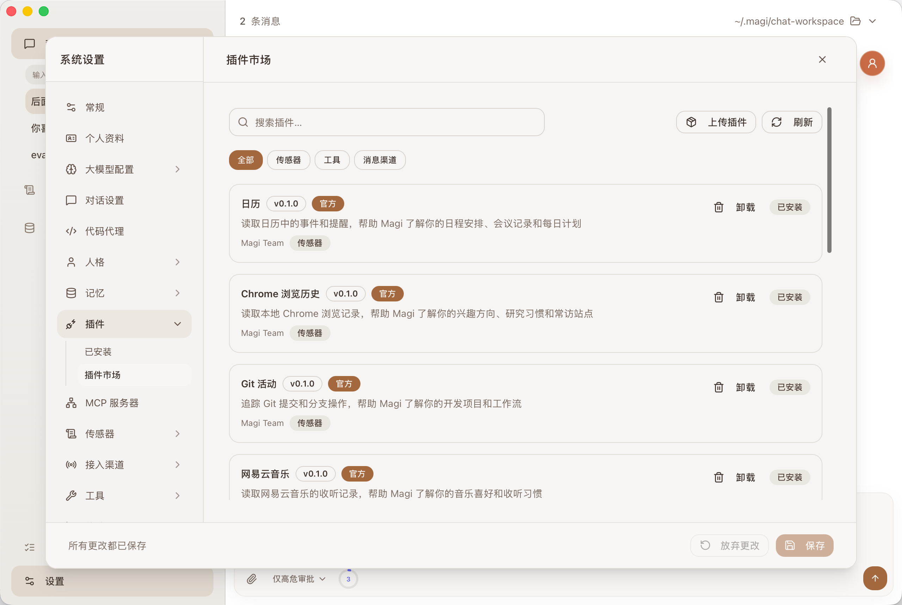

  

<h1 align="center">Magi</h1>

  <em>让时间成为上下文</em>

  
  
  
  
  

  语言：简体中文 | <a href="./README.md">English</a>

---

  

Magi 是一个本地优先的桌面 Agent，面向那些放不进单次聊天窗口里的事情。

它可以对话、调用工具、执行后台任务，也可以随着时间记住有用的上下文。只要你授权，Magi 会把对话、日历、浏览记录、Git 活动、音乐、照片和其他本地信号连成一条可以搜索、追问、修正和清空的时间线。

## 单次对话不够

很多 AI 工具最尴尬的地方，不是第一句答不好，而是第一句之后发生的事接不上。

你下周又回到同一个项目；你改过一次偏好；你纠正过模型猜错的东西；一个习惯要重复几次才看得出来。Magi 做的是把这些中间地带接起来：之前发生过什么，后来变了什么，什么仍然重要，什么不该再被使用。

- **它可以接着干** — Magi 可以回答、调用工具、请求权限、中断恢复，也可以把长任务放到后台继续运行。
- **记忆有来源** — 沉淀下来的上下文会关联到对话和授权的本地来源，你能看见它从哪里来。
- **先有时间线，再有长期记忆** — 事件会先进入可搜索、可回看的历史，再被整理成长期上下文。
- **你可以改正记录** — 不可靠的推断可以修改或移除；不想保留的记忆可以删除。
- **默认在本地** — 应用和运行数据保存在 `~/.magi`；只有模型调用或你配置的动作才会外发数据。
- **互动不会每次归零** — 人格档案、关系深度和自然回复节奏，让 Magi 不像一个每次都从零开始的命令框。

## 从时间线到记忆

Magi 的顺序很简单：先保留发生过什么，再从里面整理出值得带到未来的上下文。这样记忆不是凭空冒出来的，也方便你回看和改掉。

这条链路很简单：

1. **信号进入时间线**：对话和授权插件事件会被整理成可以搜索、回看的历史。
2. **时间线沉淀成记忆**：有用的事实、模式、经历和修正会成为长期上下文。
3. **记忆帮助后续工作**：当 Magi 回答、规划或执行任务时，可以检索相关上下文，而不是只靠当前窗口。
4. **你始终能控制**：记忆不是黑盒，你可以检查、编辑、删除和清空。

所有数据源都通过统一的插件架构接入。你授权什么，Magi 才看什么；你删除什么，Magi 就忘记什么。

## 主要功能

### 带长期上下文的对话

在本地工作区里对话，使用附件、工具和长期记忆。Magi 可以在需要时带入相关上下文，而不是每次都从一片空白开始。

查看截图

  

### 时间线

把对话和授权插件事件组织成可搜索的个人时间线，支持自然语言查询，也能展开查看来源细节。

### 可检查的记忆

查看 Magi 记住了什么、这些记忆从哪里来，修正不可靠的推断，也可以删除你不想保留的内容。

查看截图

  

  

### 人格与自然节奏

人格档案、对话模式、关系深度、动态状态。长回复会拆成多段聊天气泡，更像持续互动而不是一次性报告。

查看截图

  

### 任务与运行控制

运行一次性或定时 Agent 任务，并查看清楚的执行状态。你可以打断、调整方向、处理权限请求，或把长任务移到后台继续执行。

查看截图

  

  

### 插件与外部能力

安装、启用和配置插件，为 Magi 接入本地数据来源、工具和外部渠道。MCP 服务器和 Telegram 等渠道也可以接入同一个运行时。

大多数可安装插件维护在配套仓库 [magi-plugins](https://github.com/asukaonly/magi-plugins)。这个仓库主要承载桌面应用、Agent runtime、网关、前后端界面和插件平台。

查看截图

  

## 隐私与数据

Magi 是本地优先设计：

- **应用数据保存在本地**：macOS/Linux 在 `~/.magi/`，Windows 在 `%USERPROFILE%\.magi`
- **数据外发只发生在 LLM 调用**：你的对话和检索上下文会按需发送给你配置的模型提供商（OpenAI / Anthropic / 本地 Ollama 等）
- **权限分级**：工具执行支持权限分级，敏感操作（文件写入、commit、push 等）需要确认
- **记忆可删除**：所有沉淀的记忆都可以在记忆工作台中查看和清除

需要彻底清除 Magi 数据时，删除上述目录即可。

## Benchmark

当前长期记忆与检索链路在 LongMemEval 上达到 **87.2% accuracy**：

| LongMemEval 分类          |   Accuracy |  数量 |
| ------------------------- | ---------: | ----: |
| **Overall**               | **0.8720** | **500** |
| Multi-session             |     0.8271 |   133 |
| Single-session assistant  |     0.9286 |    56 |
| Temporal reasoning        |     0.8647 |   133 |
| Knowledge update          |     0.9231 |    78 |
| Single-session preference |     0.6000 |    30 |
| Single-session user       |     0.9857 |    70 |

在 LongMemEval `_s`（500 题）上用 LLM judge（`glm-5`）评分；换第二个 judge（`bailian`）独立评分为 87.6%。原始 predictions、逐题判分与复现步骤见 [`benchmark/longmemeval/results/v0.1.2/`](./benchmark/longmemeval/results/v0.1.2/RESULTS.md)；runner 与模型配置见 [`benchmark/README.md`](./benchmark/README.md)。

## 安装

Magi 以打包好的桌面应用交付。普通用户不需要安装 Python、Node.js 或 Rust。

1. 打开 [GitHub Releases](https://github.com/asukaonly/magi/releases)
2. 下载对应平台的最新安装包：
   - **macOS Apple Silicon**：`Magi_aarch64.dmg`
   - **macOS Intel**：`Magi_x64.dmg`
   - **Windows**：`Magi_<version>_x64-setup.exe`
3. 安装并启动 Magi
4. 完成语言、模型/提供商和基础偏好配置

## Beta 阶段说明

Magi 仍在快速迭代，请留意：

- 接口和数据 schema 可能继续调整，升级时建议关注 release notes
- 部分插件还在打磨，第三方 MCP 兼容性持续完善中
- 欢迎在 [Issues](https://github.com/asukaonly/magi/issues) 反馈问题，或在 [Discussions](https://github.com/asukaonly/magi/discussions) 参与讨论

## 文档

- [文档索引](./docs/README.md)
- [项目概览](./docs/project-overview.md)
- [产品配置指南](./docs/product-configuration-guide.md)
- [Task-Agent Runtime 架构](./docs/task-agent-runtime-architecture.md)
- [统一插件架构](./docs/plugin-extension-architecture.md)
- [插件开发指南](./docs/plugin-development-guide.md)
- [记忆系统设计](./docs/memory-system-design.md)

## 贡献

欢迎提交 Issue 和 Pull Request。开发环境搭建、构建命令和仓库结构请参考 [CONTRIBUTING.md](./CONTRIBUTING.md)。
如果你想贡献新的外部插件，通常应该前往配套仓库 [magi-plugins](https://github.com/asukaonly/magi-plugins)。

## 关于名字

`Magi` 来自《EVA》中的智能电脑系统，也可以理解为 `My Agent Gets It`——不是因为它永远知道答案，而是因为它愿意持续地认识你。

## 许可证

[MIT](./LICENSE)
