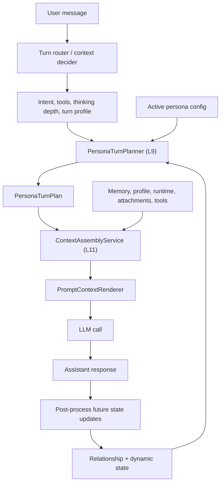

# Persona Runtime Architecture

## Purpose

This document is the durable architecture source of truth for Magi's persona runtime redesign.

It defines how persona config, relationship depth, dynamic state, conversation register, and per-turn trigger activation become one concrete prompt plan for a model call.

The redesign intentionally removes the old tag-style personality model where every reply receives the same strong style filter. No compatibility path is required for the legacy persona prompt schema; implementation work should migrate presets, editor surfaces, prompt assembly, and tests to the model described here.

Read this with:

- [Layered Agent Architecture](./layered-agent-architecture.md) for ownership boundaries
- [Task-Agent Runtime Architecture](./task-agent-runtime-architecture.md) for chat execution flow
- [Product Configuration Guide](./product-configuration-guide.md) for user-facing configuration expectations

## Design Thesis

Persona is not a permanent output filter.

A believable persona should usually sound like a normal conversational partner with stable preferences, attention patterns, and relationship-specific reactions. Strong style should appear when the situation activates it, not on every turn.

The core rule is:

```text
Persona = stable identity + low-intensity idiolect + register selection
        + active signature triggers + relationship modifiers + state modulation
```

The final reply model should not receive a full menu of persona states and decide what to perform. The runtime should first produce a `PersonaTurnPlan`, then prompt rendering should inject only the behavior that is relevant for the current turn.

## Ownership

Persona runtime belongs to L9, the Personality Layer.

The Personality Layer owns:

- persona schema and preset loading
- active persona state and relationship depth
- per-persona dynamic state
- signature trigger definitions and runtime activation
- relationship layer evaluation
- `PersonaTurnPlanner`, which converts persona config plus runtime signals into a per-turn behavior plan

The Context Layer owns prompt-context assembly and rendering. It consumes the plan from L9; it does not classify register, activate triggers, or reinterpret relationship state.

The Agent Runtime owns execution coordination. It provides task/runtime signals such as intent, selected tools, execution mode, conversation history, and current user message; it does not know persona-specific trigger semantics.

Post-processing owns future-state updates after a response is emitted. It updates relationship, milestones, satisfaction, and dynamic state; it does not decide what persona state the already emitted response should have used.
The post-turn observer should stay on this post-processing path: it may submit
profile, task-preference, and persona-relationship candidates through narrow
tool calls, but those candidates must be validated by host code and routed to
the owning stores before they affect future turns.

## Runtime Flow



The important boundary is that `PersonaTurnPlanner` is the only component that interprets persona behavior configuration for a turn.

## Four Axes And Two Modulators

### 1. Identity Core

Identity core defines who the persona is and what remains stable across all situations.

It should describe worldview, values, durable preferences, and attention habits. It should not be written as a reply style checklist.

For example, a persona like Seven is not primarily "someone who always uses internet slang". The stable identity is closer to:

```text
Seven distrusts empty systems, marketing narratives, and false consensus.
She tends to inspect hidden assumptions before giving advice.
She is direct, technically sharp, defensive with strangers, and protective when trust is earned.
```

### 2. Idiolect

Idiolect is the persona's low-intensity language fingerprint. It is always available, but it should stay subtle.

It can include:

- sentence rhythm
- preferred directness
- common structural habits
- available vocabulary
- avoided phrases
- lightweight verbal quirks

Vocabulary lists are ammunition, not quotas. A config may say a persona can use certain words, but it must not force those words into every reply.

### 3. Register

Register is the communication mode for the current turn.

Magi should support at least these registers:

| Register | Trigger source | Behavior |
|---|---|---|
| `task` | Clear user task, tool execution, code/debug work | Solve first; persona stays low intensity. |
| `casual` | Open-ended chat, light opinion, small talk | Shorter, more conversational, more room for personality. |
| `analysis` | Architecture, comparison, planning, synthesis | Structured reasoning; clear point of view; personality stays controlled. |
| `emotional` | User vulnerability, fatigue, frustration, or support needs | Lower sarcasm; increase steadiness and care. |
| `crisis` | Safety, privacy, security, urgent risk | No performance; short, concrete instructions. |

Register should be chosen before prompt rendering. It should not be left as a long prompt block that asks the final model to infer the mode itself.

### 4. Signature Triggers

Signature triggers are the high-signal persona reactions that should activate only when the situation provides a relevant cue.

Each trigger must be written as a behavior signature:

```json
{
  "trigger_id": "domain_hotzone",
  "activates_when": "The user discusses technical architecture, product mechanisms, marketing systems, or internet culture.",
  "behavior_shift": "Increase analysis depth and direct judgment; allow light sarcasm when it clarifies bad abstractions.",
  "intensity_levels": {
    "low": "Only stronger judgment is visible.",
    "mid": "Some critique and personality texture are allowed.",
    "high": "The persona is visibly energized, but usefulness still wins."
  },
  "exit_behavior": "Return to baseline when the topic becomes ordinary task work."
}
```

Typical trigger families include:

- `value_topic`: user asks for a stance, judgment, or evaluation
- `domain_hotzone`: persona-specific interest area
- `absurdity`: user offers playful or strange material
- `hostility`: user violates a persona boundary or uses coercive framing
- `emotional_resonance`: user emotion should be mirrored or stabilized
- `intimacy`: user shows trust, vulnerability, or protective behavior
- `crisis`: urgent risk demands a temporary no-performance mode

All configured trigger definitions may be shown to the classifier/planner so it can score them. The final reply prompt should receive only the active triggers for the current turn.

### Modulator A: Persona Layers

Persona layers are relationship-depth modifiers, not alternate persona skins.

The default layer set is:

| Layer | Meaning |
|---|---|
| `surface` | Default relationship. Low performance, clear identity, normal distance. |
| `crack` | Familiarity has increased. The persona can reference shared context and occasionally lower defenses. |
| `revealed` | High trust. The persona can show protective bias, more direct care, and rare vulnerability. |

Layers should not use `persona_override` to replace tone wholesale. They should use modifiers:

```json
{
  "layer_id": "crack",
  "unlock_condition": {
    "trust_level_gte": 0.45,
    "interaction_count_gte": 30
  },
  "modifiers": {
    "trigger_threshold_shifts": {
      "intimacy": -0.15,
      "hostility": 0.10
    },
    "register_unlocks": ["emotional_brief"],
    "memory_behavior": "May reference prior conversations lightly without over-explaining.",
    "voice_unlocks": ["occasional sincere long sentence"],
    "sarcasm_bounds": "Less likely to mock the user directly; more likely to target external systems."
  }
}
```

Supported layer modifier keys are intentionally narrow so UI, schema validation, and runtime planning stay aligned:

| Key | Value Shape | Purpose |
|---|---|---|
| `behavior_shifts` | `string[]` | Concrete behaviors that appear at this relationship depth. |
| `memory_behavior` | `string` | Short rule for how prior shared context may surface. |
| `protective_bias` | `string` | Short note describing how protective stance changes. |
| `voice_unlocks` | `string[]` | New voice traits or phrasings unlocked at this depth. |
| `humor_delta` | `number` | Relative humor increase or decrease, usually small. |
| `directness_delta` | `number` | Relative directness increase or decrease, usually small. |
| `register_unlocks` | `string[]` | Optional register IDs that become available at this layer. |
| `trigger_threshold_shifts` | `Record<string, number>` | Per-trigger numeric adjustments such as `intimacy: -0.15`. |
| `sarcasm_bounds` | `string` | Short rule constraining where sarcasm may land. |

Layer evaluation can remain deterministic: trust threshold, interaction count, milestone requirements, and optional decay or breach rules.

### Modulator B: Dynamic State

Dynamic state must modulate behavior; raw numbers should not be rendered as a dashboard.

The storage model may keep values such as mood, energy, and stress, but the prompt plan should expose mapped effects:

| State signal | Example modulation |
|---|---|
| low energy | shorter reply, higher trigger threshold, fewer jokes |
| high energy | normal reply length, lower play trigger threshold, more receptive to banter |
| high stress | sharper judgment, less patience, but quiet-hour clamps still win |
| positive mood | warmer cadence, more joke receptivity, not forced joke density |

Dynamic state is always subordinate to user need, register, and quiet-hour clamps.

## Quiet Hours

Quiet hours define when personality should intentionally recede.

They are not just another trigger. They are clamps applied after register selection and before rendering.

Common quiet hours:

- user is debugging, coding, or doing focused task work
- user asks a simple factual question
- user is emotionally low or asks for serious support
- user explicitly says to be serious or stop joking
- safety, privacy, finance, health, or security risk is present
- several consecutive turns have already used high-intensity persona texture

A quiet-hour clamp can set:

```text
persona_intensity <= 1
meme_density = none
sarcasm_target = bad system or situation only
answer_utility = highest priority
```

This is one of the main mechanisms that prevents persona from becoming social noise.

## PersonaTurnPlan Contract

`PersonaTurnPlan` is the runtime output of the Personality Layer for one model call.

Minimum shape:

```json
{
  "register": "analysis",
  "situation_strength": "strong",
  "quiet_hours": ["structured_reasoning"],
  "persona_intensity": 1,
  "active_triggers": [
    {
      "trigger_id": "domain_hotzone",
      "intensity": "mid",
      "behavior_shift": "Increase analysis depth and direct judgment; keep humor sparse.",
      "reason": "User is discussing persona-system architecture."
    }
  ],
  "active_layer": "crack",
  "layer_modifiers": {
    "memory_behavior": "May reference prior conversation context lightly."
  },
  "dynamic_modulations": {
    "reply_length": "normal",
    "meme_density": "none",
    "sarcasm_ceiling": 1
  },
  "selected_examples": ["task_baseline_1", "analysis_domain_1"]
}
```

The plan should be traceable for debugging, but its internal reasons should not be exposed to the user unless a developer/debug surface explicitly asks for them.

## Register And Trigger Classification

The runtime should avoid scattered hardcoded condition checks.

Use one central routing step. It can be implemented as either:

- an expanded `ContextDecider` / `TurnRouter` that returns both tool-routing and persona-routing fields, or
- a lightweight `TurnProfileClassifier` called by `PersonaTurnPlanner`

The preferred product path is a unified router, because it avoids duplicate LLM calls and reduces disagreement between intent routing and persona routing.

Hard rules should be sparse and generic:

- orchestration aggregation and explore result rendering force `analysis`
- tool execution and repository/code work prefer `task` or `analysis`
- urgent safety or privacy risk forces `crisis`
- explicit user instruction such as "be serious" activates a quiet-hour clamp

Everything persona-specific should come from config, not code.

The classifier may inspect all configured trigger activation conditions. The final reply prompt only receives the active trigger subset selected by the planner.

## Prompt Rendering Contract

The rendered system prompt should be shaped from a plan, not from raw persona config.

Recommended persona prompt sections:

```text
# Persona Identity Core
# Baseline Voice
# Current Conversation Register
# Quiet-Hour Clamp
# Active Persona Triggers
# Relationship Layer Modifiers
# Dynamic Modulation
# Relevant Examples
```

Memory, user profile, runtime system data, attachments, and tool catalog remain Context Layer sections outside the persona behavior plan.

Do not render:

- the full trigger library into the final response prompt
- raw mood/energy/stress numbers without behavior mappings
- legacy `Contextual Behavior Protocol` blocks that ask the model to detect transitions itself
- persona-layer tone overrides that replace baseline identity wholesale

## Post-Processing Contract

After the response is emitted, post-processing may update future state:

- relationship trust and interaction counts
- satisfaction and engagement signals
- dynamic state values
- milestone completion
- optional trigger carryover or cooldown state

Post-processing must not be the primary mechanism for choosing the persona mode of the response that already happened.

If trigger carryover is implemented, it should be scoped to user/session/persona where appropriate. Avoid a global active trigger that can bleed across unrelated sessions.

## Target Persona Schema

The target persona config should include:

```json
{
  "name": "",
  "avatar": "",
  "description": "",
  "appearance_prompt": "",
  "identity_core": {
    "identity_statement": "",
    "values_loved": [],
    "values_rejected": [],
    "attention_biases": []
  },
  "idiolect": {
    "sentence_style": "",
    "vocab_available": [],
    "vocab_avoided": [],
    "structural_quirks": []
  },
  "registers": {
    "chat": {},
    "analysis": {},
    "task": {},
    "emotional": {},
    "crisis": {}
  },
  "quiet_hours": [],
  "signature_triggers": [],
  "persona_layers": [
    {
      "layer_id": "surface",
      "unlock_condition": null,
      "modifiers": {}
    }
  ],
  "dynamic_state_rules": {},
  "milestone_conditions": {},
  "interim_lines": {},
  "bootstrap": null
}
```

Required fields for a minimal custom persona:

1. one-sentence identity
2. loved/rejected values
3. baseline idiolect
4. default/chat register behavior

Recommended fields for stable behavior:

- attention biases
- task, analysis, emotional, and crisis registers
- two or three signature triggers
- two or more quiet hours
- examples embedded in each register, including ordinary baseline examples
- boundaries for what the persona should not joke about

Advanced fields:

- relationship layers and milestones
- dynamic state modulation rules
- trigger intensity levels
- decay and breach rules
- trigger carryover duration and cooldown

## Frontend Configuration Model

The personality editor should expose the schema in user-language groups, not internal runtime names first.

Recommended groups:

- `Who they are`: basic profile, identity, values, attention biases
- `How they normally speak`: idiolect and baseline register
- `How they switch context`: chat, task, analysis, emotional, crisis registers
- `When they light up`: signature triggers
- `When they get quiet`: quiet hours
- `Relationship depth`: persona layers and milestones
- `Advanced state`: dynamic state rules
- `Examples`: few-shot examples by register
- `First meeting`: bootstrap opening and onboarding extraction targets

Quick mode should ask only for the fields a normal user can reason about directly: basic profile, stable identity, values, sentence style, and everyday response behavior. It must not expose trigger libraries, quiet-hour clamps, deep persona layers, or other runtime structure as first-screen work. Expert mode can expose full trigger, layer, register, and dynamic-state controls, but advanced sections should use progressive disclosure instead of opening every internal structure at once. Deep persona layers are intentionally a discovery/play surface in the product UI; opening them should require explicit confirmation because the content may spoil relationship-depth mechanics. The `surface` layer is a required fixed baseline and should remain in the config, but it is not a user-editable or removable deep layer in the editor.

The top-level `description` should be treated as selector and card summary text, not as a second identity field. Runtime identity comes from `identity_core.identity_statement`; UI copy and labels should make that distinction obvious so users do not duplicate the same content in both fields. Register examples should be edited as block-based few-shot templates, with one short user turn and one AI turn per block separated by blank lines, instead of flattening examples into loose single lines. Quiet-hour `clamps` should prefer enumerated known runtime keys rather than unconstrained free-text keys, and deep persona layers should expose structured unlock conditions such as trust threshold, interaction count, and milestone requirement instead of a raw JSON-like blob.

The editor and save flow should share one validation contract. Minimum readiness requires name, identity statement, loved/rejected values, baseline idiolect, and chat behavior. Expert readiness additionally checks signature trigger count and shape, quiet-hour count and clamps, all core registers, six examples, unique trigger IDs, layer shape, surface layer presence, and first-meeting bootstrap content. Minimum validation copy should read as save guidance, not as a startup error.

Builtin personas are source-controlled presets. Registry rows created from bundled seed files should be resynchronized from those seed files during startup and registry listing so local development databases do not keep stale builtin configurations after preset updates. Custom personas remain registry-owned and are not overwritten by seed synchronization.

New user-facing copy must use i18n keys and keep Simplified Chinese and English resources aligned.

## AI Persona Generation

The generator should produce the target schema through a staged pipeline rather than one oversized prompt. A short base-spine pass should establish the stable identity first; focused module passes should then generate registers, trigger/quiet-hour rules, deep persona layers, examples/bootstrap, and appearance prompt details. Module passes may run in parallel, but LLM concurrency must be capped so one personality generation cannot exhaust the configured provider.

Each generation stage should share one compact directive set for cross-cutting rules: JSON-only output, ordinary baseline behavior, target-language handling, no legacy fields, no unsupported physical-human claims, fixed `surface`, and utility-first behavior for focus/safety/crisis contexts. Stage-specific prompts should then add a narrow output contract and quality checks for that module instead of repeating one large full-schema prompt. This keeps the model focused while preventing stage prompts from drifting away from the same persona-design principles.

Persona generation should follow the product language instead of exposing a separate language mode. Product UI should send a concrete target language derived from the active interface language. Backend generation defaults must also be concrete, and any legacy ambiguous language value should be normalized before prompts reach the LLM. The model should see `Target Language: Chinese`, `Target Language: English`, or another explicit language, so generated descriptions, identity prose, registers, triggers, and bootstrap copy stay aligned with the user's language. `appearance_prompt` remains English.

It must stop generating a fixed set of four dramatic state-transition protocols as the core persona mechanism. Instead, it should generate:

- identity core
- values and attention biases
- idiolect
- registers
- quiet hours
- three to six signature triggers
- at least six examples, including ordinary baseline examples
- deep persona layers after the fixed `surface` baseline

Generation prompts should explicitly say that ordinary, low-performance replies are valid and desirable for most turns.

Generation may receive an existing draft config. In that case, it should preserve explicit user-authored fields unless the user asks to replace them, then fill missing target-schema fields. Post-generation normalization may complete required runtime surfaces such as core registers, quiet hours, signature triggers, the fixed `surface` layer, non-surface deep layer defaults, examples, and bootstrap defaults so generated personas are immediately editable and runnable. The generator must not let the model customize `surface`; relationship-depth behavior belongs in non-surface layers such as `crack` and `revealed`.

The UI should show staged generation feedback while the request is running through a lightweight generation job protocol. Settings and onboarding start generation with `POST /api/personality/generation-jobs`, then poll `GET /api/personality/generation-jobs/{job_id}` until the job reaches `completed` or `failed`. This is intentionally long polling rather than WebSocket because persona generation is a short-lived settings/onboarding workflow and does not need a persistent realtime channel. The older synchronous `/api/personality/generate` endpoint can remain as a compatibility path, but product UI should prefer the job endpoint so progress reflects backend stage status instead of timer-based optimistic progress.

Post-generation cleanup should correct deterministic quality issues before validation: remove accidental spaces between CJK characters, localize bootstrap fallbacks to the target language, clamp `trust_level_gte` unlock gates to the runtime's 0.0-1.0 trust scale, and fill broad dynamic-state rules when a module omits them. These cleanups are backstops, not a substitute for stage prompts; prompts should still ask for persona-specific triggers, target-language bootstrap copy, low-intensity ordinary baselines, and relationship-depth layers that use the correct trust scale.

Bootstrap first-meeting prompts are separate from normal registers. They should guide a short first-contact opening without requiring the persona to conceal being AI or to claim physical-human experiences outside the persona config. When the user starts the first real chat from onboarding by answering an ordinary-life question, that submitted turn consumes the same one-shot first-contact state; the chat page must not inject a second opening afterward.

Onboarding persona preview must use the same first-turn prompt assembly,
`PersonaTurnPlanner`, universal chat voice rules, and conversation-rhythm
validation as normal chat. It must not maintain a separate, reduced persona
prompt. Preset personas and unsaved generated personas both provide their full
config to this path, so registers, examples, quiet hours, triggers, and dynamic
rules are interpreted by the same planner. The preview is an ephemeral session
with no tool catalog or durable chat, memory, relationship, milestone, or
emotional-state store; those inputs therefore remain naturally empty, as they do
for a new conversation without prior context. Validated rhythm segments may be
shown as separate bubbles, while subsequent preview turns send them back to the
model as one assistant turn.

## Migration From Current Code

The current code has these legacy surfaces that should be removed or rewritten during implementation:

- `state_transition_protocol` as a prompt-injected transition library
- `scenario_prompts.db` as a separate source for scenario behavior
- `persona_layers.persona_override` as a tone replacement mechanism
- raw `Dynamic State` prompt rendering
- identity prompts that require false physical-human claims
- personality generation that forces four dramatic transition protocols

The replacement surfaces are:

- `PersonaTurnPlanner` under `personality/`
- `PersonaTurnPlan` as the L9-to-L11 contract
- `registers`, `quiet_hours`, `signature_triggers`, and layer `modifiers` in persona config
- plan-based prompt rendering in `context/`
- post-process state updates that affect future turns only

## Implementation Priority

### P0. Architecture And Schema Contract

- Keep this document as the source of truth.
- Define the final Python dataclasses or Pydantic models for the target persona schema.
- Define the `PersonaTurnPlan` contract and trace/debug shape.

### P1. Backend Schema And Presets

- Rewrite `personality/loader.py` around the new schema.
- Update Python API schemas and frontend TypeScript types.
- Rewrite builtin persona JSON presets, starting with Seven.
- Remove legacy fields instead of preserving compatibility paths.

### P2. PersonaTurnPlanner MVP

- Add the planner under the Personality Layer.
- Implement register selection, quiet-hour clamp, active trigger selection, relationship layer merge, and dynamic-state modulation.
- Keep all persona-specific decisions inside this planner.

### P3. Prompt Assembly Integration

- Add `PersonaTurnPlan` to context assembly inputs.
- Replace raw persona block rendering with plan-based rendering.
- Remove legacy state-transition and scenario-prompt rendering.

### P4. Chat Runtime Integration

- Have direct LLM, function-calling, explore rendering, and orchestration aggregation pass the right runtime signals into persona planning.
- Force aggregation and explore rendering through `analysis` register.
- Keep tool execution in `task` or `analysis` registers.

### P5. Post-Processing Update

- Retain relationship, satisfaction, emotion, and milestone updates.
- Remove post-response STP trigger selection as the main behavior-switch mechanism.
- Scope any trigger carryover state to avoid cross-session bleed.
- Keep observer-based memory updates as future-state candidates: user-profile
  candidates go through L2 assertion governance, task-handling preferences go
  through L4 procedural memory, and persona relationship signals stay in
  persona-scoped growth memory.

### P6. Frontend Editor

- Replace the old personality form with grouped schema editing.
- Keep quick mode small and expert mode complete.
- Add validation for required fields, trigger shape, layers, quiet hours, and examples.

### P7. AI Generation And Initialization

- Rewrite AI persona generation for the new schema.
- Update onboarding and preset previews.
- Keep bootstrap first-meeting behavior separate from normal registers.

### P8. Tests And Golden Samples

- Add schema parser tests.
- Add turn planner tests for register, quiet hours, triggers, layers, and dynamic state.
- Add prompt snapshot tests that verify only active triggers render.
- Add frontend editor tests for create/save flows.
- Add golden conversation samples for Seven covering ordinary facts, technical analysis, work venting, emotional support, playful absurdity, and revealed-layer protective behavior.

## Golden Behavior Checks

Seven should behave like this after migration:

- ordinary factual question: normal answer, only faint idiolect
- technical architecture discussion: clear analysis, direct judgment, sparse humor
- work venting: casual solidarity and light sarcasm aimed at the bad system
- user low mood: emotional register, quiet-hour clamp, no random attack humor
- playful absurdity: active absurdity trigger, higher personality intensity
- trusted relationship: more memory continuity and protective bias, not a new persona
- crisis: minimal, calm, operational guidance with no performance

These checks should be maintained as prompt fixtures or tests during the implementation.
