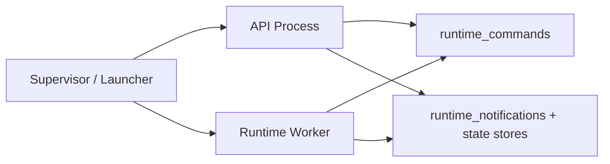

# Dual-Process Lifecycle Topology Design

**Goal:** Define the startup, shutdown, supervision, and health model for the split backend topology so the API process and runtime worker behave like one coherent local system.

**Scope:** Single-machine deployment only. This design covers the current `api` and `runtime_worker` roles and the shared SQLite-backed command/notification channels already introduced in the backend.

## Why This Needs A Separate Design

The codebase now supports role-aware bootstrap:

- `api`
  Transport, read-side services, command enqueue, websocket notification fan-out
- `runtime_worker`
  Agent runtime, scheduler execution, memory integration, background pipelines, command consumption

This solves runtime ownership, but it does not yet define the **system-level lifecycle contract**:

- who starts both processes
- how readiness is reported
- what happens if one process starts late or crashes
- how shutdown should drain in-flight work

Without that contract, dual-process mode remains implementation-capable but operationally ambiguous.

## Process Relationship

The relationship should be modeled as **sibling processes supervised by one launcher**, not as parent-child business dependencies.

### Business relationship

- API depends on runtime for execution capacity
- runtime does not depend on API implementation details
- both depend on shared persisted channels and storage

### Operational relationship

- both are started and stopped by one supervisor
- neither process should be responsible for spawning the other
- local desktop/web tooling should treat them as one backend topology

## Startup Model

### Recommended startup order

1. Start the shared launcher/supervisor.
2. Start the runtime worker first.
3. Wait until runtime heartbeat is healthy.
4. Start the API process.
5. Mark the overall backend topology as ready only after both roles report healthy.

### Why runtime first

- the API immediately accepts user messages and enqueues commands
- if runtime is not alive, queue backlog begins growing from the first user action
- websocket bridge currently begins tailing notifications from the latest seen notification id on startup, so starting API after runtime reduces ambiguous startup windows for live push

### Acceptable degraded startup

For local-first development and recovery, the API may still start when runtime is absent, but it should expose this as **degraded mode**, not full readiness.

The API should:

- accept read-only requests
- optionally accept message enqueue if backlog policy allows it
- surface runtime unavailable state in health/readiness responses
- return actionable enqueue errors once backlog or offline thresholds are exceeded

## Health And Readiness Model

Health must be split into **per-role liveness** and **topology readiness**.

### API process health

The API is healthy when:

- FastAPI transport is running
- DI/bootstrap completed
- command queue is reachable
- runtime trace store is reachable

### Runtime worker health

The runtime worker is healthy when:

- bootstrap completed
- command processor loop is running
- scheduler loop is running
- local runtime modules are initialized
- heartbeat is being refreshed

### Topology readiness

The system is fully ready when:

- API is healthy
- runtime worker heartbeat is fresh
- command backlog is within configured threshold

### Proposed readiness states

- `ready`
  API healthy and runtime healthy
- `degraded`
  API healthy but runtime missing, stale, or backlog unhealthy
- `starting`
  one or both processes are still booting
- `stopping`
  supervisor has initiated graceful shutdown

## Heartbeat Contract

Add a lightweight runtime heartbeat record owned by `runtime_worker`.

### Proposed heartbeat fields

- `role`
  `runtime_worker`
- `instance_id`
  random process instance id
- `pid`
  OS process id
- `started_at_ms`
  process boot time
- `last_seen_at_ms`
  most recent heartbeat time
- `status`
  `starting | ready | draining | stopping`
- `queue_backlog`
  optional recent pending command count
- `active_turns`
  optional current active turn count
- `active_workers`
  optional current active worker count
- `last_error`
  optional summarized fatal loop error

### Storage choice

For the first cut, keep heartbeat in SQLite alongside the current local-first stores.

This is enough for:

- API readiness reporting
- desktop/dev supervisor checks
- operator visibility

No new infrastructure is required for this part.

## Startup Supervision

### Recommended first-cut supervision model

Use a dedicated **launcher process or script** that starts both roles explicitly.

Options:

1. Python supervisor entrypoint
2. shell/dev script for local development
3. Tauri host supervision for desktop packaging

### Recommended responsibilities of the supervisor

- generate or propagate shared runtime environment
- start `runtime_worker`
- wait for runtime heartbeat freshness
- start `api`
- forward `SIGINT/SIGTERM`
- observe child exit codes
- stop the sibling process if one exits unexpectedly

### Failure policy

If runtime dies:

- API stays alive briefly in degraded mode
- supervisor should attempt bounded restart of runtime
- if restart fails repeatedly, supervisor may stop API and report fatal backend topology failure

If API dies:

- runtime should not continue forever unattended in normal product mode
- supervisor should stop runtime and fail the backend topology

This keeps the topology easy to reason about for a local product.

## Shutdown Model

Graceful shutdown should be supervisor-driven and role-aware.

### Recommended shutdown order

1. Mark topology as `stopping`.
2. Stop API intake for new user messages.
3. Keep read-only API endpoints available briefly if practical.
4. Ask runtime worker to enter `draining`.
5. Wait up to a configured drain timeout.
6. Stop runtime worker.
7. Stop API process.

### Drain behavior

During `draining`, runtime should:

- stop claiming new commands
- finish in-flight command handling if possible
- flush pending notifications/state writes
- stop scheduler launches for new background work

### Drain timeout

Use a small bounded timeout in the first cut, for example:

- default: 10 seconds
- local dev override: shorter
- production/desktop override: configurable

After timeout:

- force-stop runtime worker
- rely on persisted command queue for later recovery if needed

## API Behavior While Runtime Is Down

The API process should not pretend the topology is fully healthy when runtime is stale.

### Recommended behavior

- `GET` read-side endpoints keep working
- websocket connections stay accepted
- readiness reports `degraded`
- message send returns either:
  - accepted with explicit queued/degraded state, or
  - rejected with actionable runtime unavailable error

### Recommended first cut

Allow enqueue while runtime is offline only if:

- queue store is healthy
- pending backlog remains below threshold

Otherwise reject with a clear runtime unavailable code.

This prevents silent unbounded queue growth.

## Notification Replay Semantics

Current websocket bridge tails notifications from the latest notification id at startup.

That means:

- API restart does not replay old notifications by default
- the frontend must rely on state/read-side queries for recovery

### Recommended first cut

Keep this behavior, but document it explicitly:

- runtime notifications are **best-effort live fan-out**
- persistent read-side state remains the source of truth

This is acceptable because:

- final responses and traces are persisted
- reconnecting clients can re-query history and trace state

If stronger replay is needed later, add per-client notification cursors separately.

## Dev And Packaging Implications

### Local development

`dev-hot.sh` or a new dedicated script should:

- start `python backend/run_server.py --role runtime_worker`
- wait for runtime heartbeat
- start `python backend/run_server.py --role api`
- stop both on Ctrl+C

### Desktop packaging

The desktop runtime should choose one of two explicit models:

1. bundle one supervisor sidecar that launches both roles
2. bundle two sidecars and let Tauri supervise both

The preferred first cut is **one supervisor entrypoint** because:

- lifecycle is centralized
- shutdown policy is easier to enforce
- desktop troubleshooting is simpler

## Recommended Implementation Order

1. Add runtime heartbeat storage and a small runtime status service.
2. Add API readiness fields that distinguish API health and runtime health.
3. Add a local supervisor entrypoint/script for dual-role startup.
4. Add graceful shutdown with runtime drain mode.
5. Update desktop/dev packaging scripts to launch the chosen topology.

## First-Cut Decisions

- Keep single-machine only.
- Keep SQLite-backed shared state for heartbeat and readiness.
- Use one supervisor to manage both processes.
- Start runtime before API in supervised mode.
- Keep websocket notification replay best-effort; rely on read-side state for recovery.
- Treat runtime-down as degraded mode, not silent full readiness.

## Validation Checklist

- Starting the supervisor launches runtime first, then API.
- API readiness distinguishes `ready` from `degraded`.
- Runtime heartbeat becomes stale when the runtime process is killed.
- API remains readable when runtime is down.
- Shutdown stops new intake, drains runtime briefly, and exits both processes cleanly.
- Desktop/dev tooling launches and stops the intended topology predictably.
