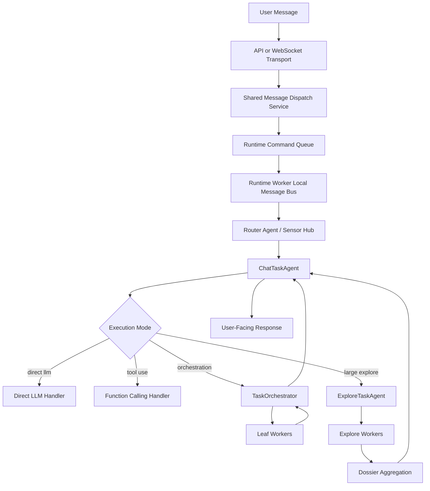

# Task-Agent Runtime Architecture

## Purpose

This document describes the current backend runtime architecture for bootstrap, task-agent orchestration, worker execution, scheduler registration, and the service and transport boundaries around them.

It is implementation-oriented and should stay synchronized with the current codebase.

## Design Intent

The current runtime is built around four ideas:

- keep the composition root thin
- keep user-facing task logic in task agents instead of workers
- keep workers leaf-only and tightly scoped
- use typed internal contracts for execution, orchestration, worker results, and classified facts

## Composition Root

The composition root lives in `backend/src/magi/bootstrap/`.

Important files:

- `backend.py`
  Starts and stops the runtime through `ModuleLifecycleOrchestrator`

- `builder.py`
  Builds the ordered lifecycle module list from the owning layers

- `context.py`
  Defines the shared bootstrap context slices

- `exports.py`
  Exports initialized runtime services to the DI container and runtime-binding boundary

### Bootstrap context slices

The bootstrap context is intentionally split by ownership instead of using one generic bag of runtime state.

Key slices include:

- core
- llm
- message bus
- memory
- personality
- plugins
- timeline
- scheduler
- agent runtime

This keeps ownership explicit and stops bootstrap assembly from becoming a hidden business layer.

## Bootstrap Order

Lifecycle modules are built in dependency order in `bootstrap/builder.py`.

The current sequence is:

1. core dependencies
2. configuration
3. runtime command queue
4. message bus
5. plugin system
6. llm runtime
7. memory stores
8. tools
9. skills
10. personality
11. sensors and actions
12. context assembly
13. agent runtime
14. timeline service
15. scheduler engine
16. sensor schedule registration
17. runtime exports
18. L2 maintenance schedule registration
19. maintenance dependencies

Important rule: bootstrap order is dependency order, not ownership order. For example, the scheduler engine is infrastructure even though it is started after timeline services that will register schedules into it.

## Main Runtime Flow

## Runtime And Persistence Boundaries

The current dual-process topology is intentionally split by responsibility:

- API process
  Accepts user input, writes `chat.db`, enqueues runtime commands, and serves read-side chat and trace APIs. It does not own the runtime message bus.

- runtime worker
  Consumes commands and plugin ingress events, fans out local runtime events on the in-process message bus, updates `chat.db`, writes `runtime_trace.db`, and projects canonical memory facts into `l1_events.db`

Persistence is separated the same way:

- `chat.db`
  Source of truth for `chat_sessions`, `chat_turns`, and `chat_messages`
  Current path: `~/.magi/data/chat/chat.db`

- `runtime_trace.db`
  Execution observability only, including spans, tool calls, turn summaries, intent records, live notifications, and append-only plugin ingress events emitted by the desktop shell or other local producers
  Current path: `~/.magi/runtime/runtime_trace.db`

- `memory/l1_events.db`
  Canonical memory projection only; it stores `user_text` and `assistant_final` as lossy memory facts, but it is no longer the chat transcript source of truth
  Current path: `~/.magi/data/memory/l1_events.db`

- `message_queue.db`
  Runtime command queue only
  Current path: `~/.magi/runtime/message_queue.db`

- `cache/plugins/<plugin_id>/`
  Rebuildable plugin-owned runtime state such as in-progress sensor aggregation files
  Current path pattern: `~/.magi/cache/plugins/<plugin_id>/`

Important rule: runtime notifications are best-effort live fan-out of already committed chat state. Transcript recovery and reload must come from `chat.db`, not from notifications or `fact_events`.

Important rule: the runtime message bus is process-local to `runtime_worker`. It is not a durable cross-process broker and it does not own SQLite queue persistence.

## Agent Runtime

The L11 runtime lives under `backend/src/magi/agent/`.

### `TaskAgent`

The shared base loop lives in `agent/runtime/task_agent.py`.

It acts as a typed pipeline over these stages:

1. `build_context`
2. `match_intent`
3. `match_tools`
4. `assemble_llm_params`
5. `call_llm`
6. `parse_result`

The base class is generic over runtime context, intent result, tool selection, execution request, and execution result.

### `ChatTaskAgent`

Primary user-facing task agent in `agent/task_agents/chat_task_agent.py`.

Current responsibilities:

- build chat runtime context
- delegate execution routing to the chat execution coordinator
- own chat-specific session and postprocess services
- delegate prompt-package assembly to the L10 context layer service
- render final user-facing answers

### Conversation presentation planning

Intent routing now also produces a chat-facing presentation decision for each turn.

- `IntentDecision`
  Still owns routing outputs such as `execution_mode`, selected tools, and orchestration strategy

- `TurnUXPlan`
  Owns presentation-facing guidance such as whether the assistant should surface a final reply, a reaction-only acknowledgement, an interim-then-final flow, and whether trace or tool-chain UI should be hidden or collapsible

Important rule: chat UI behavior should not depend directly on raw intent-classifier details. The coordinator should translate intent and execution shape into a stable presentation contract, and downstream chat-domain services should react to that contract instead of re-implementing routing heuristics.

`TurnUXPlan` is now persisted on `chat_turns.ux_plan_json` and reused by both runtime notifications and history read models. This keeps reload behavior aligned with the same presentation contract that was active when the turn originally ran.

### Context-owned prompt assembly

Prompt assembly ownership lives in `backend/src/magi/context/`.

The current split is:

- `ChatTaskAgent.build_context`
  Builds typed runtime context such as fact classification, explicit session identity, conversation history, tool errors, active orchestrations, and routing environment facts like OS, current datetime, timezone, workspace path, and home directory

- `ContextAssemblyService`
  Owns prompt-context policy, implicit retrieval query selection, prompt module assembly, and final system prompt rendering

- `ChatPromptService`
  Owns plain LLM invocation and chat-specific helper text for aggregation and dossier rendering

This keeps runtime fact assembly in the task agent while moving prompt-context ownership back into the context layer.

Current implicit-memory policy is intentionally conservative:

- default implicit injection is `L0` only
- user profile and preferences still come from personality/profile memory, not retrieval payload expansion
- `L4` procedural memory is opt-in and currently requires a user message that explicitly asks to reuse a prior workflow or usual process
- `L2` and `L3` are not injected implicitly by default and should instead flow through explicit memory/tool usage when needed

Explicit historical recall is handled separately from implicit prompt injection:

- `ContextDecider` remains a fast classifier and only performs a lightweight rule-based post-pass to mark explicit memory recall requests
- when such a request is detected, `memory_query` is promoted into the selected tool set and a routing-scoped structured hint payload (`routing_memory_hint`) is attached for first-attempt parameters
- that first-attempt hint now carries a recall-intent taxonomy such as `event_recall`, `preference_recall`, `profile_fact_recall`, `relationship_recall`, or `workflow_reuse`
- parameter hint generation is handled by rules, not by an extra LLM planning step, to keep routing latency and variance low
- the main LLM may still discover additional memory needs later during function calling and issue a refined tool call; the routing hint is advisory, not the final execution payload
- once `memory_query` has returned, its answer-facing `historical_recall` payload is marked as the source of truth for historical recall in the current turn, and final-response prompt rules explicitly forbid replacing missing recall results with implicit memory or guesses
- raw retrieval traces remain in the debug/trace path and are not reinjected into the main LLM tool-message context

### `ExploreTaskAgent`

Specialized task agent in `agent/task_agents/explore_task_agent.py`.

Current responsibilities:

- accept large exploration requests from chat
- plan bounded explore subtasks
- delegate worker orchestration to `TaskOrchestrator`
- aggregate completed worker results into a Markdown dossier
- send the dossier back upstream to `ChatTaskAgent`

### `TaskOrchestrator`

Shared parent-task orchestrator in `agent/task_orchestrator.py`.

Current responsibilities:

- start parent orchestration
- persist orchestration state
- launch leaf workers
- process worker progress, completion, and failure updates
- apply retry policy
- trigger final aggregation

### `WorkerAgentManager`

Leaf worker lifecycle manager in `agent/workers/worker_manager.py`.

Current responsibilities:

- launch workers of specific types
- restrict available tools by worker type
- validate worker result schema
- publish worker progress and completion facts
- persist worker results for parent-task recovery

Workers remain leaf executors and do not recursively create other workers.

## Typed Execution Framework

The shared execution framework lives under `agent/task_agents/common/`.

Important files:

- `contracts.py`
- `handlers.py`
- `llm_service.py`

### Execution modes

Execution is routed by `ExecutionMode`:

- `FACT_ONLY`
- `DIRECT_LLM`
- `FUNCTION_CALLING`
- `ORCHESTRATION_LAUNCH`
- `ORCHESTRATION_UPDATE`
- `EXPLORE_TASK_RENDER`

### Request and handler model

The general pattern is:

1. a coordinator chooses an `ExecutionMode`
2. it creates an `ExecutionRequest`
3. a handler specializes that request into a mode-specific DTO
4. the handler returns an `ExecutionResult`

This replaced older ad hoc dictionary passing with explicit typed contracts.

## Internal Contracts

The most important contract families are:

- execution contracts in `agent/task_agents/common/contracts.py`
- runtime context and intent contracts in `agent/task_agents/chat/contracts.py` and `agent/task_agents/explore/contracts.py`
- orchestration contracts in `agent/orchestration.py`
- worker result contracts in `agent/orchestration.py`

Transport boundaries still use dictionaries where practical, but internal runtime logic should prefer typed DTOs.

## Service Boundaries

The product-facing service boundary lives in `backend/src/magi/api/services/`.

Current rules:

- shared business-facing helpers belong in `api/services/`
- transport handlers should call those services instead of reimplementing routing logic
- runtime-domain code should not reach back into API services

### Shared message dispatch

`api/services/message_dispatch_service.py` is the shared write path for user messages from both HTTP and websocket transports.

It owns:

- runtime initialization checks
- runtime command queue availability checks
- explicit `session_id` validation for incoming messages
- runtime command publication
- queue-size reporting for callers

This keeps `api/routers/messages.py` and `websocket/handlers.py` transport-thin.

### Read services

`ChatReadService` and `ChatTraceReadService` remain shared read-side services.

They are intentionally separated from runtime orchestration, but they still use module-scoped shared instances today and are tracked in the backlog for further cleanup.

`ChatReadService` now reads canonical session metadata from the `chat_sessions` table instead of aggregating sessions on demand from L1 fact rows. The frontend owns the currently selected session and reads history or trace data by passing an explicit `session_id`.

## Runtime Binding Boundary

`core/runtime_bindings.py` is the exported boundary for selected initialized services such as:

- message bus
- scheduler service
- sensor scheduler contributor
- plugin manager
- other memory
- user message sensor
- skills bindings

Current rule:

- routers, transport handlers, and shared external-facing services may use runtime bindings for explicit read-side/runtime-owned services, but API bootstrap does not expose the runtime message bus
- runtime-domain code should prefer explicit injection from lifecycle assembly or owning managers

## Scheduler Targets

The scheduler runtime currently supports two active target families:

- `sensor_sync`
- `memory_l2_maintenance`

The scheduler engine lives in `scheduler/service.py`. Layer-owned schedule registration is performed by:

- `SensorScheduleRegistrationModule`
- `L2MaintenanceScheduleRegistrationModule`

This keeps scheduling policy with the owning layers instead of centralizing it in one runtime module.

## Memory Event Flow

The current memory write path is:

1. runtime or timeline code emits a raw event or fact
2. `MemoryIntegrationModule` normalizes it into a memory event contract
3. routing decides whether it is `l0_only`, `l0_and_l1`, or `l1_only`
4. `UnifiedMemoryStore` writes it into the enabled lifecycle stages
5. `L1`-backed cognition work is recorded as durable `l2_projection_jobs` in `memory.db`
6. `L2Pipeline` claims those jobs inside `runtime_worker`, moves them through `queued -> running`, batches them locally, and writes derived cognition state
7. retrieval surfaces read from event, cognition, reflection, and procedural memory as needed

Two rules matter here:

- high-frequency runtime telemetry should not automatically participate in long-term cognition
- `L1` is the durable source of truth for long-term memory, while `L0` remains execution-scoped
- `ActionExecuted` stays execution-scoped and does not enter `L1`, even though its outcome may still update `L4` procedural memory
- `L2` progress is tracked by durable projection jobs, while microbatching remains an in-process execution optimization

## Runtime Trace Flow

Execution observability is owned by the dedicated runtime trace store rather than the memory event store.

The current runtime trace path is:

1. chat postprocess, function-calling orchestration, and worker execution write canonical trace rows directly
2. `runtime_trace.db` stores turn summaries, spans, LLM call details, tool call details, and intent-resolution records
3. `ChatTraceReadService` reconstructs the UI trace tree from those canonical rows
4. websocket and message APIs expose trace summaries and snapshots without routing trace nodes through `L1`

Two rules matter here:

- runtime trace data is execution observability, not durable memory
- `L1` stores recall-worthy facts, while `runtime_trace.db` stores execution structure and metrics

## Timeline Pull-Sync Flow

Pull-capable timeline sensors participate in the runtime like this:

1. the scheduler fires a `sensor_sync` target
2. the target handler resolves the sensor from `SensorRegistry`
3. the sensor collects source items
4. those items are normalized through sensor output and memory contracts
5. downstream consumers such as `TimelineAdapter` project the ingested outputs into timeline read models

This is how plugin-backed local sources participate in timeline ingestion without each source inventing its own background loop.

## Transport Boundary

Transport handling lives in `backend/src/magi/websocket/` plus thin HTTP app wiring.

Current rule:

- transport code handles connection lifecycle, request translation, and push mechanics
- product behavior belongs in `api/services/` or lower runtime layers
- websocket and HTTP entry points should share business write paths where practical

## Explore Request Path

For a large codebase exploration request, the path is:

1. `ChatTaskAgent` receives a user fact
2. `ChatExecutionCoordinator` decides the request should decompose
3. Chat routes the request to `ExploreTaskAgent`
4. `ExploreTaskAgent` builds a `SubtaskPlan`
5. `TaskOrchestrator` launches leaf Explore workers
6. Workers return typed `WorkerResult`
7. `ExploreAggregationService` builds a Markdown dossier
8. `ExploreTaskAgent` emits an `ExploreTaskCompletedPayload`
9. `ChatTaskAgent` renders the final user-facing response

## Files To Read First

If you are modifying this part of the system, read these first:

- [task_agent.py](/Users/asuka/code/magi/backend/src/magi/agent/runtime/task_agent.py)
- [chat_task_agent.py](/Users/asuka/code/magi/backend/src/magi/agent/task_agents/chat_task_agent.py)
- [explore_task_agent.py](/Users/asuka/code/magi/backend/src/magi/agent/task_agents/explore_task_agent.py)
- [task_orchestrator.py](/Users/asuka/code/magi/backend/src/magi/agent/task_orchestrator.py)
- [orchestration.py](/Users/asuka/code/magi/backend/src/magi/agent/orchestration.py)
- [worker_manager.py](/Users/asuka/code/magi/backend/src/magi/agent/workers/worker_manager.py)
- [memory/__init__.py](/Users/asuka/code/magi/backend/src/magi/memory/__init__.py)
- [integration.py](/Users/asuka/code/magi/backend/src/magi/memory/integration.py)
- [hybrid_retrieval/service.py](/Users/asuka/code/magi/backend/src/magi/memory/hybrid_retrieval/service.py)

## Current Strengths

- Chat and explore task agents now share the same execution skeleton
- Workers are leaf-only and bounded
- Internal contracts are much more explicit than before
- The runtime can now be reasoned about in terms of stable DTOs instead of ad hoc payload dictionaries
- Memory ingestion and retrieval now share one lifecycle model instead of multiple loosely coupled memory stacks

## Current Risks

- [common/contracts.py](/Users/asuka/code/magi/backend/src/magi/agent/task_agents/common/contracts.py) is growing and may need to be split by concern
- `TaskOrchestrator` is still a dense class and may eventually need event-adapter separation
- Event transport payloads are still dict-based externally, so contract drift is still possible if new event producers bypass the typed classifiers
- Memory quality now depends more heavily on correct event routing and source taxonomy, so runtime producers must follow the memory event contract carefully

## Contributor Guidance

When adding a new runtime feature:

1. Decide whether it belongs to chat, explore, worker, or shared orchestration.
2. Prefer adding a typed contract before adding a new raw payload field.
3. If a new internal event is introduced, add a payload DTO and update the relevant classifier.
4. Keep workers leaf-only unless the architecture deliberately changes.
5. Keep user-facing rendering in task agents, not in workers.

When in doubt, prefer:

- typed DTO inside the runtime
- serialized dict only at the process or storage edge
