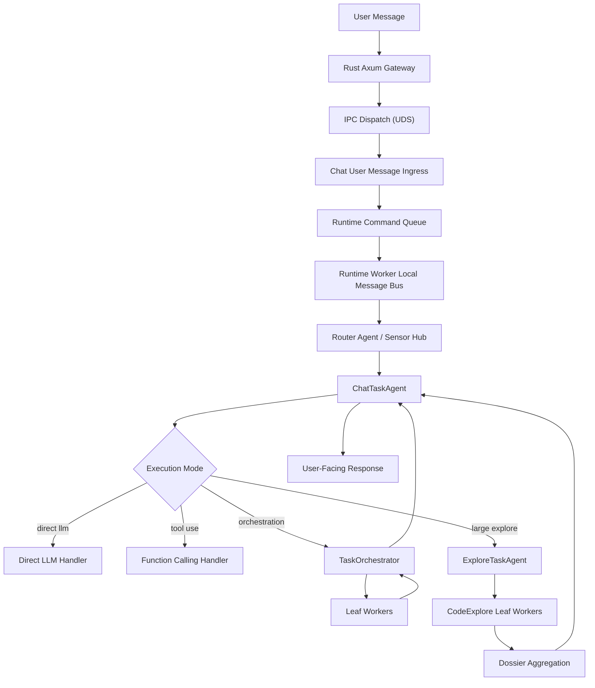

# Task-Agent Runtime Architecture

## Purpose

This document describes the current backend runtime architecture for bootstrap, task-agent orchestration, worker execution, scheduler registration, and the service and transport boundaries around them.

It is implementation-oriented and should stay synchronized with the current codebase.

## Design Intent

The current runtime is built around four ideas:

- keep the composition root thin
- keep user-facing task logic in task agents instead of workers
- keep workers leaf-only and tightly scoped
- use typed internal contracts for execution, orchestration, worker results, and classified facts

## Composition Root

The composition root lives in `backend/src/magi/bootstrap/`.

Important files:

- `backend.py`
  Starts and stops the runtime through `ModuleLifecycleOrchestrator`

- `builder.py`
  Builds the ordered lifecycle module list from the owning layers

- `context.py`
  Defines the shared bootstrap context slices

- `exports.py`
  Exports initialized runtime services to the DI container and runtime-binding boundary

### Bootstrap context slices

The bootstrap context is intentionally split by ownership instead of using one generic bag of runtime state.

Key slices include:

- core
- llm
- message bus
- memory
- personality
- plugins
- timeline
- scheduler
- agent runtime

This keeps ownership explicit and stops bootstrap assembly from becoming a hidden business layer.

## Bootstrap Order

Lifecycle modules are built in dependency order in `bootstrap/builder.py`.

The ordered runtime-worker phase catalog is centralized in `bootstrap/runtime_worker_builder.py` via `get_runtime_worker_phase_definitions()` and `describe_runtime_worker_phase_plan()`. Keep docs, readiness surfaces, and operational logs aligned with that manifest.

The current runtime-worker sequence in `bootstrap/runtime_worker_builder.py` is:

### Phase 1: infrastructure bring-up

1. `runtime_core_dependencies`
2. `runtime_configuration`
3. `runtime_command_queue`
4. `runtime_message_bus`
5. `runtime_chat_store`
6. `runtime_plugin_system`
7. `runtime_llm`

### Phase 2: stateful services and read/write stores

8. `runtime_memory`
9. `runtime_chat_projector`
10. `runtime_trace`
11. `runtime_tools`
12. `runtime_skills`
13. `runtime_personality`
14. `runtime_sensor_hub`
15. `runtime_context`
16. `runtime_agent_core`

### Phase 3: long-running processors and business services

17. `runtime_command_processor`
18. `runtime_plugin_ingress_processor`
19. `runtime_timeline`
20. `runtime_scheduler`
21. `runtime_agent_schedule_registration`
22. `runtime_sensor_scheduler`
23. `runtime_sensor_sync_executor`

### Phase 4: exports and maintenance registration

24. `runtime_exports`
25. `runtime_control_plane`
26. `runtime_l1_maintenance_scheduler`
27. `runtime_l2_maintenance_scheduler`
28. `runtime_l2_consolidation_scheduler`
29. `runtime_l2_derive_scheduler`
30. `runtime_l3_summary_scheduler`
31. `runtime_l3_maintenance_scheduler`
32. `runtime_l4_maintenance_scheduler`
33. `runtime_timeline_schedulers`
34. `runtime_operational_gc_scheduler`
35. `runtime_other_dependencies`
36. `runtime_channels`
37. `runtime_outreach`

Important rule: bootstrap order is dependency order, not ownership order. For example, the scheduler engine is infrastructure even though it is started after timeline services that will register schedules into it.

Important rule: `runtime_llm` is the current deferral boundary. If LLM selections are incomplete or invalid during onboarding, startup stops there and later phases do not run.

## Deferred Startup Mode

When `LLMRuntimeModule` cannot initialize, startup enters a deliberate deferred mode instead of failing the whole worker process.

In this mode:

- already-started infrastructure modules stay alive
- the worker readiness snapshot reports `startup_state=deferred`
- `/api/ready` and `/api/health` report degraded startup state instead of pretending the full runtime is ready
- lightweight configuration and skills flows remain available
- bootstrap opening generation must fall back to static persona config until `scenario_llm_pool` becomes available

The modules that are expected to remain usable in deferred mode are:

- runtime command queue
- message bus
- chat store
- plugin manager
- sensor registry
- runtime trace store

This is why onboarding and early settings screens can still function before the full agent runtime is online.

## Readiness States

The runtime now exposes two layers of state:

- worker liveness
  Gateway `/api/ready` asks the IPC worker over the local worker channel with a
  short timeout. When the worker itself answers, liveness is derived from the
  process-local startup snapshot. If the worker channel does not answer in
  time, the gateway reports `runtime_status=unresponsive`.

- event-loop delay diagnostics
  The IPC worker keeps a lightweight monitor that logs when the runtime event
  loop is delayed. It does not write runtime readiness rows into
  `runtime_trace.db`; persisted trace data is kept for execution observability.

- full runtime readiness
  Derived from worker liveness plus critical bindings such as `scenario_llm_pool` and `agent_runtime`

Current startup-state values are:

- `offline`
  No live worker signal is available

- `starting`
  The worker is still assembling lifecycle modules

- `deferred`
  Infrastructure is up, but the LLM/runtime boundary has not completed yet

- `ready`
  Full runtime is online and exported to the DI container

- `failed`
  Startup or shutdown hit a non-recoverable runtime error

- `stopping`
  Runtime shutdown is in progress

- `unresponsive`
  The gateway is alive but the IPC worker did not answer the bounded readiness request

Frontend flows should treat `ready` as the only state that guarantees first-chat bootstrap and normal agent execution are fully available. `deferred` is intentionally usable for onboarding and configuration, but not equivalent to a fully initialized runtime.

## Main Runtime Flow

Routing policy keeps worker decomposition for requests whose required
evidence or implementation surface is genuinely larger than a single
chat turn. External-world `general-purpose` decomposition is reserved
for explicit broad research signals such as many requested items,
citations, links, source lists, multi-source comparison, verification,
or report-style synthesis. Bounded external planning, advice, and
option comparison can still use direct function-calling with web tools;
they should not become parallel worker orchestration simply because the
domain is travel, food, transit, news, or local geography. This policy
prevents ordinary advisory follow-ups from becoming parent-task
orchestration while preserving decomposition for source-heavy news
research, repository-wide analysis, migration plans, and other broad
verification work.

  During function-calling turns, the execution LLM may also use a bounded
  tool-discovery helper to recover from missing-capability situations.
  This helper is not a general capability browser. It is an execution-time
  recovery mechanism that can append a very small number of additional
  tools or skills to the current turn when the existing allowlist cannot
  complete the next grounded step. Its first-stage recall is owned by the
  tools layer through a unified discovery index over registered tools and
  skill metadata. Builtin tools, plugin-contributed tools, and MCP adapter
  tools enter this index through the shared tool registry; skills enter through
  the registered skill metadata index. Each candidate is normalized into a
  compact search document made from its name, split name tokens, description,
  category, source, tags, selected metadata, argument hints, examples, and
  top-level parameter names/descriptions. The first-stage recall ranks these
  documents with in-memory BM25 plus small capability-family boosts for broad
  classes such as memory, photo, and attachment tasks; the query side may use
  lightweight multilingual expansion, while candidate documents stay close to
  their real schema text so descriptions are not inflated into unrelated
  capabilities. The builtin helper then applies execution-context checks and L4
  advisory reranking before returning the bounded expansion payload. The helper
  may reuse a short-lived same-session discovery result when the query, active
  registry, feature flags, permissions, and current-tool set are unchanged. Its
  tool result includes compact discovery metrics, such as candidate/recommendation
  counts by source and whether a cache hit occurred, so runtime traces can be
  used to evaluate recall quality and cache stability without moving discovery
  policy into the routing layer.

  ContextDecider stays a coarse, cheap classifier. It may emit `tool_need`
  as `none`, `direct`, or `discover`, but it does not formulate a
  `tool_query` or own the final provider tool surface. When `tool_need` is
  `discover`, chat coordination starts a normal function-calling turn with
  the resident `find-relevant-tools` entry so the main model can ask for the
  missing concrete capability. The query should describe one focused capability
  gap with the relevant domain/action/object and facts already known; it should
  not be the whole user request or a broad capability-browsing prompt.
  `TurnRouteResolver` then owns final per-turn route resolution. It derives the
  dispatch shape from the coarse route, attachments, orchestration signal, and
  final selected tools; it also builds the provider-facing tool surface by
  appending resident runtime-control tools, conditionally exposing `agent`, and
  applying same-session tool-superset reuse when it is safe for the turn's write
  policy. `FunctionCallingHandler` consumes that resolved tool surface; it does
  not reimplement those routing rules.

  For session-bound function-calling turns, `FunctionCallingHandler` remains the
  chat-mode entry point, while `FunctionCallingCheckpointLoop` owns the
  checkpoint-aware execution loop. That loop coordinates cancel, detach,
  mid-run steering, pending-turn checkpoint rebuilds, one-step tool execution,
  and fallback response generation. Keeping that loop outside the handler keeps
  chat entry routing separate from long-running tool-run control flow.

  Reply-target continuity in chat is intentionally compact but now carries more than plain text excerpts.
  When a user replies to an earlier assistant message, the runtime may include a sanitized structured payload summary from that replied-to message, such as managed attachment references, so follow-up turns can reuse concrete artifacts without re-exposing raw local file paths.
  Tool-driven chat turns may persist this reusable state through assistant message payloads. In particular, function-calling tools can return a sanitized `assistant_payload` with generic `asset_refs`, which later reply turns may see through reply context and hand back to source resolver tools before calling `prepare_chat_attachments`.
  Tools that directly create local media, such as `image-generation`, should also use the existing managed `chat_attachments` channel for immediate chat presentation and may include attachment-backed `assistant_payload.asset_refs` for reply-turn reuse. They should not rely on raw workspace file paths as the long-lived chat protocol.
  Beyond explicit reply targets, chat prompt assembly may inject a compact `Recent Tool State` block derived from the last few tool interactions in the same session. This block is intentionally lossy: tool name, coarse success/failure state, short outcome summary, limited reusable handles, and coarse duration only.
  Important rule: `Recent Tool State` is continuity guidance for the chat LLM, not the canonical execution audit trail. Exact parameters, full outputs, and detailed timing remain in `runtime_trace.db` and should be queried through trace read APIs or the builtin `trace_query` tool.

  Chat attachment continuity follows the same compact-reference pattern. The runtime may include a lightweight session attachment manifest in prompt context containing managed `attachment_id` values, names, kinds, and coarse parse metadata. Full attachment text is not permanently embedded in every turn; follow-up questions about earlier files should use the managed attachment id with the builtin `read_chat_attachment` tool, which resolves the session-owned resource and performs Python-side text/PDF reading on demand. When the current user turn is an explicit reply to an earlier attachment-bearing message, that reply target is annotated in the latest user prompt and its attachments are treated as effective current-turn attachments for routing and multimodal grounding.

## Runtime And Persistence Boundaries

The current dual-process topology is intentionally split by responsibility:

- API process
  Accepts user input, writes `chat.db`, enqueues runtime commands, and serves read-side chat and trace APIs. It does not own the runtime message bus.

- runtime worker
  Consumes commands and plugin ingress events, fans out local runtime events on the in-process message bus, updates `chat.db`, writes `runtime_trace.db`, and projects canonical memory facts into `l1_events.db`

Persistence is separated the same way:

- `chat.db`
  Source of truth for `chat_sessions`, `chat_turns`, and `chat_messages`
  Current path: `~/.magi/data/chat/chat.db`

  Assistant chat messages may persist managed attachment payloads in `chat_messages.payload_json`.
  Chat messages may also store `persona_id` as the active persona identity snapshot for same-thread multi-persona conversations. The row stores only the stable persona ID; display name and avatar are resolved from the persona registry when rendering history.
  Chat prompt assembly also receives the stored turn `persona_id` and resolves that persona record, including soft-deleted records, when building the system prompt for direct replies, function-calling replies, explore result rendering, and orchestration aggregation.
  Local source plugins should not bypass this boundary by exposing raw local file paths directly to the frontend.

- `runtime_trace.db`
  Execution observability only, including spans, tool calls, turn summaries, intent records, live notifications, and append-only plugin ingress events emitted by the desktop shell or other local producers
  Current path: `~/.magi/runtime/runtime_trace.db`

  Chat prompt assembly may derive compact recent-tool summaries from recent tool interaction records, but those summaries are explicitly lossy and must not replace `runtime_trace.db` as the source of truth for execution details.

### Session Prompt History And Rolling Summaries

Chat prompt history is selected by context budget instead of a fixed message-count window.
Short sessions can be passed to the model as raw transcript history. When the raw session tail would exceed the prompt-history budget, prompt assembly keeps the newest raw messages and prepends a compact session-origin anchor so the model still knows where the thread began.

Durable rolling summaries live with chat truth in `chat.db`, not in long-term memory tables. The `chat_context_summaries` table stores session-scoped continuation state: the active summary text, the summary kind, the parent summary, the covered transcript frontier, and the first raw message that should be kept after the summary. A later summary supersedes the previous active summary in the same session/scope, so normal prompt assembly reads only the latest active summary plus the raw tail after its frontier.

`ChatHistoryService` owns the runtime bridge from durable summary state into prompt history. When an active `token_budget` summary exists for a session, the service loads `session_origin` and `summary_text`, trims raw prompt history from `first_kept_message_id`, and passes those fields through `ChatRuntimeContext`. Direct LLM and function-calling execution both feed that summary context into prompt message assembly before appending the current user turn.

`ChatTranscriptSummarizer` runs after chat responses are persisted, off the response critical path. It estimates the prompt-history token footprint, summarizes the older raw range when the retained tail grows beyond the trigger budget, and activates a new `token_budget` summary. If summary A is active, the next summary is generated from summary A plus the newly covered raw range, then summary B supersedes A for normal prompt reads.

Workbench Memory may expose the active `token_budget` summary and the latest context-budget usage snapshot for the selected session. This is a session-continuation inspection surface: it helps users understand what was compressed and how full the recent prompt context was, without promoting the summary into long-term memory layers.

Function-calling loops have a separate per-turn compaction guard inside the agent execution layer. That guard uses the configured `core` scenario context window when available, compacts only the mutable tool-loop message list, and does not own durable session summaries.

Persona switches add a second prompt-history boundary. When a session tail contains messages from an older active persona followed by the current persona's segment, `ChatHistoryService` condenses the older segment into an active `persona_boundary` summary scoped by the current persona ID. Prompt assembly then receives the neutral boundary summary plus only the raw tail for the current persona segment, so continuity survives without carrying another persona's assistant voice into the active persona prompt.

Memory retrieval remains a separate input to prompt assembly. Long-term memory can be queried alongside session summaries, but session summaries are not promoted into L1/L2/L3/L4 by default because they are continuation checkpoints rather than canonical cross-session facts.

- `memory/l1_events.db`
  Canonical memory projection only; it stores `user_text` and `assistant_final` as lossy memory facts, but it is no longer the chat transcript source of truth
  Current path: `~/.magi/data/memory/l1_events.db`

- `message_queue.db`
  Runtime command queue only
  Current path: `~/.magi/runtime/message_queue.db`

- `scheduler.db`
  Unified scheduler definitions, target runtime state, schedule execution records, and queued sensor-sync jobs
  Current path: `~/.magi/runtime/scheduler.db`

  Product task surfaces read this store through `/api/schedules` to display enabled schedules and current/upcoming scheduler activity. They may manually trigger an enabled schedule once through `/api/schedules/{schedule_id}/run`, which executes with `manual=True` while preserving the schedule's normal future cadence. Sensor-owned schedules remain derived from timeline source settings and must be updated through the sensor settings UI instead of direct schedule edits.

  Agent-created schedules use the `user_agent_task` scheduler target. They are created and managed through the builtin `schedule` tool, store an `agent_task` payload, and enqueue a background task when fired. The scheduler owns timing and execution bookkeeping; the background-task runtime owns the actual LLM/tool execution.
  Successful background tasks that produce a user-facing LLM summary are delivered back to the originating chat session as ordinary `assistant_final` messages, while the background-task row remains available for audit/debug status.

- `cache/plugins/<plugin_id>/`
  Rebuildable plugin-owned runtime state such as in-progress sensor aggregation files
  Current path pattern: `~/.magi/cache/plugins/<plugin_id>/`

Important rule: runtime notifications are best-effort live fan-out of already committed chat state. Transcript recovery and reload must come from `chat.db`, not from notifications or `fact_events`.

Important rule: the runtime message bus is process-local to `runtime_worker`. It is not a durable cross-process broker and it does not own SQLite queue persistence.

## Agent Runtime

The L12 runtime lives under `backend/src/magi/agent/`.

Agent-owned scheduler targets are registered by `AgentScheduleRegistrationModule` after `runtime_scheduler` starts. The current supported target is `user_agent_task`; its handler converts the persisted schedule payload into a `BackgroundTaskSpec` and enqueues it through `BackgroundTaskManager` with `trigger_source=schedule`.

### `TaskAgent`

The shared base loop lives in `agent/runtime/task_agent.py`.

It acts as a typed pipeline over these stages:

1. `build_context`
2. `match_intent`
3. `match_tools`
4. `assemble_llm_params`
5. `call_llm`
6. `parse_result`

The base class is generic over runtime context, intent result, tool selection, execution request, and execution result.

### `ChatTaskAgent`

Primary user-facing task agent driver in `chat/task_agent/chat_task_agent.py`.

Current responsibilities:

- build chat runtime context
- delegate execution routing to the chat execution coordinator
- own chat-specific session and postprocess services
- delegate prompt-package assembly to the L11 context layer service
- render final user-facing answers

Runtime collaborator construction for the chat driver lives in
`chat/task_agent/runtime_dependencies.py`. `ChatTaskAgent` receives the built
parts and runs the turn pipeline; it should not directly instantiate the
coordinator, prompt/planning/postprocess services, handler registry, or
function-calling orchestrator. Bootstrap still injects the top-level
`create_chat_agent_factory` plus runtime adapters such as delivery, conversation
log, and message bus accessors, while chat-domain assembly stays inside the chat
domain.

The chat driver is still a task-agent implementation, but graph execution is not
chat-owned. `ChatExecutionCoordinator` prepares the chat request and delegates
graph-backed execution to `agent/run/TaskAgentExecutionEngine`; graph building,
node registration, node adapters, sequence running, and snapshot persistence stay
behind that engine boundary.

`ChatExecutionCoordinator` remains the sequence coordinator, not the owner of every
per-turn policy. Chat-facing presentation decisions live in
`chat/task_agent/turn_ux_planner.py`, while runtime tool hints, recommendation
ordering, and procedural-memory tool reranking live in
`chat/task_agent/tool_selection_service.py`. Foreground/background placement
lives in `chat/task_agent/run_placement_service.py`: after tools are selected
but before handler request construction, the chat driver may turn an automatic
long-task decision into a background launch request. If launch fails, the
coordinator builds the normal foreground request and continues safely.

### Conversation presentation planning

Intent routing now also produces a chat-facing presentation decision for each turn.

- `IntentDecision`
  Still owns routing outputs such as `execution_mode`, selected tools, and orchestration strategy

- `TurnUXPlan`
  Owns presentation-facing guidance such as whether the assistant should surface a final reply, a reaction-only acknowledgement, an interim-then-final flow, and whether trace or tool-chain UI should be hidden or collapsible

Important rule: chat UI behavior should not depend directly on raw intent-classifier details. The coordinator should translate intent and execution shape into a stable presentation contract, and downstream chat-domain services should react to that contract instead of re-implementing routing heuristics.

`TurnUXPlan` is now persisted on `chat_turns.ux_plan_json` and reused by both runtime notifications and history read models. This keeps reload behavior aligned with the same presentation contract that was active when the turn originally ran.

Active execution placeholders are a live tail control for the current turn, not a transcript event. Chat clients should render the active runtime-status card or interim execution placeholder after other in-run transcript/control messages, and remove or quiet that placeholder once a final assistant message finalizes the turn.

The current call-trace visibility policy intentionally separates storage from presentation:

- runtime trace persistence should remain available for every user-visible turn so support, debugging, and history reload can recover the execution path consistently
- `DIRECT_LLM` replies should surface a lightweight trace entry with `trace_display_mode=collapsible`
- tool-driven and orchestration-backed turns should surface a stronger trace affordance with `trace_display_mode=prominent`
- internal `FACT_ONLY` turns and reaction-only acknowledgements should keep `trace_display_mode=none` because they do not represent a user-visible answer flow

Important rule: trace-entry visibility is a UX decision, not the storage boundary. If a user-visible turn produced trace data, prefer preserving retrieval and reload fidelity even when the chat surface chooses a lighter affordance.

Conversation rhythm extends this presentation boundary after execution handlers
produce a canonical answer. The core direct-LLM, function-calling, and
orchestration-render handlers still return a single authoritative
`ExecutionResult.response_text`; when enabled, the main reply may contain
internal bubble-boundary markers that chat post-processing validates and turns
into a multi-message presentation plan. See
[Conversation Rhythm Architecture](./conversation-rhythm-architecture.md) for
the segmentation contract, persistence shape, and streaming restrictions.

Chat post-processing also owns the final response delivery shape. It derives a
small final-response plan after outcome persistence, then passes that plan to
the injected delivery seam. Delivery branching for single-message, streamed, and
conversation-rhythm responses lives in `chat/task_agent/postprocess/delivery.py`,
so new chat-surface delivery behavior should not be added to the post-process
service coordinator itself. `ChatTaskAgent` wires the seam at construction time
and does not mutate post-processing internals after the coordinator is built.

### Interruption Dispositions

When a user sends another message while a chat turn is already running, the `SessionRunCoordinator` classifies the interruption into one of four dispositions and routes it accordingly. The classifier lives in `backend/src/magi/chat/task_agent/interruption_classifier.py` and combines rule-based keyword matching with an optional LLM fallback.

- `INTERRUPT`
  The new message contradicts or cancels the running turn (for example, "stop", "wait", "nevermind"). The active run is cancelled and a new root turn starts from scratch. The `ActiveRun` revision bumps and in-flight tool results are discarded.

- `AUGMENT`
  The new message re-scopes the running turn (for example, "instead of …", "switch to …", "改用 …"). The two turns are merged at the next planner checkpoint: the root user message and the augmenting turn are concatenated into a single visible user message, the prompt is rebuilt from `conversation_history`, and any tool results that belonged only to the abandoned scope are dropped. The merge shape is captured as `TurnSupersession(turn_id=root, anchor_turn_id=newest, reason="augment")` entries.

- `STEER`
  The new message adds information without changing scope (for example, "also …", "by the way …", "补充 …", "另外 …"). The tool loop keeps running and tool results are preserved; the steer text is drained from the persistent queue at the top of the next iteration and appended to `state.messages` as a plain user message, so the next LLM call sees it without rebuilding the prompt. Supersession bookkeeping uses `reason="steer"` with the same root-plus-intermediate shape as AUGMENT.

- `DEFER`
  The new message is unrelated or better treated as a follow-up (for example, "帮我看看 github 的仓库吧" while an email draft is in flight). It stays on the queue until the current turn finalizes, then triggers a new root turn via `consume_deferred_turns`.

All four dispositions are persisted to L0 working memory on `l0_execution_pending_turns.disposition`, so a backend restart preserves queued AUGMENT / STEER / DEFER turns and the next chat turn drains them instead of losing them.

AUGMENT and STEER share the same persistent queue and the same supersession shape but differ in when and how they are consumed:

- AUGMENT waits for the next planner checkpoint, is consumed through `consume_pending_turns(disposition="augment")` in `SessionRunCoordinator.aroute`, and rebuilds the prompt. It is appropriate when in-flight tool results would be invalidated by the new scope.
- STEER is consumed every iteration through `consume_steer_turns` driven by `FunctionCallingHandler._drain_pending_steer_turns`, pushes into a per-turn `SteerInbox`, and is applied via `FunctionCallingOrchestrator.apply_steer_messages`. It is appropriate when in-flight tool results are still valuable and only need additional context to finish well.

### Context-owned prompt assembly

Prompt assembly ownership lives in `backend/src/magi/context/`.

The current split is:

- `ChatTaskAgent.build_context`
  Builds typed runtime context such as fact classification, explicit session identity, conversation history, recent tool errors, recent lightweight tool state, active orchestrations, and routing environment facts like OS, current datetime, timezone, workspace path, and home directory

- `ContextAssemblyService`
  Owns prompt-context policy, implicit retrieval query selection, prompt module assembly, and final system prompt rendering

- `PersonaTurnPlanner`
  Lives in the Personality Layer and produces the per-turn `PersonaTurnPlan` consumed by prompt assembly. Chat runtime provides the current user message, execution mode, intent/tool-routing hints, stored `persona_id`, relationship state, and dynamic persona state as inputs, but it does not interpret persona-specific triggers itself.

- `ChatPromptService`
  Owns plain LLM invocation and chat-specific helper text for aggregation and dossier rendering

This keeps runtime fact assembly in the task agent while moving prompt-context ownership back into the context layer.

Persona behavior follows the same boundary: the task agent builds runtime facts, the Personality Layer plans persona behavior, and the Context Layer renders that plan. The final system prompt should receive the selected register, quiet-hour clamps, active triggers, relationship modifiers, and dynamic-state modulations, not the full raw persona rule library. The durable contract is documented in [Persona Runtime Architecture](./persona-runtime-architecture.md).

Prompt caching follows the same ownership split. The cacheable system head contains stable identity and persona definition only. Per-turn tool-use guidance, persona steer, memory/profile context, runtime facts, attachments, and recent tool state are turn-scoped context and must stay below the cache boundary so changing the selected tools does not invalidate the stable persona prefix.

The prompt text must not duplicate the provider-facing tool catalog. Concrete tool names, descriptions, parameter schemas, and tool-specific rules belong in the function-calling `tools` parameter owned by the execution/tool layer. The context layer may render only short cross-tool guidance such as when to verify with available tools or how to recover from failures.

### LLM capacity scheduling

LLM scenarios still own model selection: `core`, `context_decider`,
`memory_summarizer`, `embedding`, and other scenarios decide which provider,
model, capability set, and context window a call uses. Runtime capacity is a
separate concern owned by `LLMConcurrencyLimiter`.

The limiter keeps one shared total cap per provider/base-url/model/request
family key, then schedules waiters by request priority:

- high priority: foreground chat, direct replies, function-calling decisions, and streamed user-facing responses
- medium priority: chat-origin L2 extraction and its immediate entity/conflict resolution work
- low priority: non-chat L2 extraction, L2 maintenance work, and L3 summary generation

Low and medium priority calls may use idle capacity, but they cannot consume the
last reserved slot when the model cap is greater than one. This keeps at least
one slot available for a high-priority foreground chat call without increasing
the provider/model concurrency ceiling. The limiter can only prioritize queued
work; it does not preempt provider requests that have already started.

Current implicit-memory policy is intentionally conservative:

- default implicit injection is `L0` only
- user profile and preferences still come from personality/profile memory, not retrieval payload expansion
- `L4` procedural memory is opt-in and currently requires a user message that explicitly asks to reuse a prior workflow or usual process
- `L2` and `L3` are not injected implicitly by default and should instead flow through explicit memory/tool usage when needed

Explicit historical recall is handled separately from implicit prompt injection:

- `ContextDecider` remains a fast classifier and only performs a lightweight rule-based post-pass to mark explicit memory recall requests
- routing prompt assembly may include only a compact top-N subset of notable `L4` tool advisories rather than dumping every known procedural note into `Tool Experience Notes`
- when such a request is detected, `memory_query` is promoted into the selected tool set and a routing-scoped structured hint payload (`routing_memory_hint`) is attached for first-attempt parameters
- that first-attempt hint now carries a recall-intent taxonomy such as `event_recall`, `preference_recall`, `profile_fact_recall`, `relationship_recall`, or `workflow_reuse`
- parameter hint generation is handled by rules, not by an extra LLM planning step, to keep routing latency and variance low
- the main LLM may still discover additional memory needs later during function calling and issue a refined tool call; the routing hint is advisory, not the final execution payload
- once `memory_query` has returned, its answer-facing `historical_recall` payload is marked as the source of truth for historical recall in the current turn, and final-response prompt rules explicitly forbid replacing missing recall results with implicit memory or guesses
- that `historical_recall` contract may carry compact `entity_refs` and `asset_refs` alongside human-readable findings so later turns can reuse concrete entities or assets without leaking raw source paths into the chat protocol
- raw retrieval traces remain in the debug/trace path and are not reinjected into the main LLM tool-message context
- cross-turn tool continuity uses only a compact chat-specific summary block; old raw tool transcripts, full arguments, and full results are not replayed into the general chat prompt

### Function-calling recovery rules

`FunctionCallingOrchestrator` owns the bounded tool loop used by chat turns,
workers, and background tasks. The loop treats some failures as terminal for
the current plan instead of spending extra LLM rounds on retries that cannot
change the outcome:

- provider content-inspection failures are classified as
  `CONTENT_INSPECTION_FAILED`, retain a compact upstream error trace for
  diagnostics, and do not trigger automatic replanning
- provider configuration failures and provider challenges, including
  `NO_PROVIDERS_CONFIGURED`, `PROVIDER_NOT_CONFIGURED`, and
  `PROVIDER_CHALLENGE`, are terminal for the current failed tool path; the
  runtime suppresses the failed tool for the rest of the turn instead of
  spending additional LLM rounds on equivalent retries
- an unchanged tool call that already failed in the same loop is blocked with
  `REPEATED_FAILED_TOOL_CALL`; the model must change parameters or choose a
  different path before another attempt is allowed
- final response synthesis should prefer the latest successful verification or
  listing evidence over older failed attempts, and a dry-run reporting zero
  planned operations is treated as current-state evidence rather than an
  instruction to ask the user to run a script
- before execution starts, router-selected tools and static fallback tools are
  post-processed through shared `L4` advisory reranking so breaker-open tools
  can be skipped and historically better-fitting tools can move earlier in the
  current-turn allowlist

Tool-message context stays compact. Large listing-style tools, including
`glob` and `file_list`, plus web-search result and failure payloads, expose
bounded summaries to the LLM while leaving exact execution details in
`runtime_trace.db`.

Worker failures preserve a compact diagnostic chain for final aggregation:
function-calling execution records failed tool name, error code, short error
text, and selected provider guidance fields; worker failure facts carry that
list internally; `TaskOrchestrator` persists it on the failed subtask as
`failure_details`. Aggregation should use this to explain scoped gaps and next
actions instead of reducing every worker failure to a generic
`ALL_TOOLS_FAILED` label.

Structured worker failures must preserve the same diagnostic chain even when
the worker model returns a typed `result_status="failed"` payload. The
worker-authored failure reason is useful context, but it must not replace the
tool-layer provider errors needed for user-facing recovery guidance.

Execution-time tool discovery remains bounded and append-only. When the
execution model calls `find-relevant-tools`, the helper still starts from the
runtime registry plus tool/skill metadata, but it now reranks tool candidates
through `L4` procedural advisory before appending anything to the current
turn. Historical signals such as circuit-breaker state, success rate,
context-fit, and extracted strategy hints can promote or demote candidates;
tools with an open breaker are skipped for the current turn instead of being
re-added as likely next steps.

Tool discovery ranks builtin tools, plugin/MCP tools, and skills in one
candidate list instead of always appending skills after tools. BM25 remains the
baseline retrieval path because it works without an embedding model and is
stable for names, descriptions, and parameter fields. Lightweight multilingual
query expansion and capability-family boosts are only a recall aid for common
cross-language gaps such as calendar availability, weather, photo, web, code,
attachment, and memory tasks. This remains a bounded recovery path, not a full
capability browser.

### `ExploreTaskAgent`

Specialized task agent in `agent/task_agents/explore_task_agent.py`.

Current responsibilities:

- accept large exploration requests from chat
- plan bounded explore subtasks
- delegate worker orchestration to `TaskOrchestrator`
- aggregate completed worker results into a Markdown dossier
- send the dossier back upstream to `ChatTaskAgent`

### `TaskOrchestrator`

Shared parent-task orchestrator in `agent/task_orchestrator.py`.

Current responsibilities:

- start parent orchestration
- persist orchestration state
- launch leaf workers
- process worker progress, completion, and failure updates
- apply retry policy
- trigger final aggregation

Final aggregation keeps instructions and evidence separate. The system prompt
contains the aggregation role and response contract; the final user message
contains the original user request plus the internal evidence dossier. Do not
encode dynamic worker evidence or tool failure payloads into the system prompt,
and do not use tool-role messages unless there is a provider-valid assistant
tool-call message for them to answer.

If every subtask failed and no completed worker evidence exists, chat should
bypass full aggregation and use the lightweight failure-status path instead.
That path uses the core model with thinking disabled, sends only the original
request plus attempted/failed step diagnostics, and asks for an intermediate
status update rather than a final conclusion. This avoids spending a full
analysis synthesis round when there is no evidence to synthesize.

Final aggregation and lightweight failure-status rendering are user-visible
stream sources when a stream sink is active. Planner and worker text/reasoning
streams remain hidden, but `aggregator` and `failure_status` text/reasoning
deltas may flow into the chat bubble and mark the orchestration result as
streamed so the final notification is not duplicated.

### `WorkerAgentManager`

Leaf worker lifecycle manager in `agent/workers/worker_manager.py`.

Current responsibilities:

- launch workers of specific types
- restrict available tools by worker type
- validate worker result schema
- publish worker progress and completion facts
- persist worker results for parent-task recovery

Workers remain leaf executors and do not recursively create other workers.
They also do not own user-facing control state: worker tool profiles exclude
`todo_write`, and function-calling execution rejects worker-originated
`todo_write` calls even if a stale or custom profile exposes the tool.

When a parent task passes conversation context into a worker, that inherited
context is launch-only. The worker sees it on the first function-calling
decision so it can disambiguate the assignment, then the loop drops it before
subsequent tool iterations. Repeated tool-loop prompts keep the worker system
contract, assigned task, and observed tool results, not the full parent
conversation snapshot.

`CodeExplore` workers are workspace/codebase inspectors with a deliberately
narrow tool profile (`glob`, `grep`, `file_read`, plus `find-relevant-tools`
when registered). This leaf worker type is for
current repository, source-code, and local-file evidence only. `ExploreTaskAgent`
is the higher-level codebase exploration orchestrator that can decompose a large
repo request into multiple `CodeExplore` workers. Planning normalization must
route external-life, local geography, travel, transit, weather, restaurant,
news, current-place, and other web evidence tasks to `general-purpose` workers
so web-search or other external provider tools are available.

Worker outputs must still satisfy the typed worker-result contract, but the
validator accepts a JSON object embedded in surrounding prose or a fenced code
block before checking required fields. This keeps minor formatting drift from
turning an otherwise valid worker result into an orchestration failure.

## Background Tasks

Long-running goals that the user doesn't want to watch live run in a
dedicated subsystem under [backend/src/magi/agent/background/](../backend/src/magi/agent/background/).
It is separate from the `ChatTaskAgent` turn loop so a detached task
can outlive the originating session, survive a backend restart, and
report back asynchronously.

Key components:

- `BackgroundTaskStore` ([store.py](../backend/src/magi/agent/background/store.py))
  — SQLite-backed persistence for task rows and an append-only event
  log. Owns restart recovery (``running`` / ``cancelling`` rows from a
  previous process become ``failed(reason="backend_restart")``) and
  ``purge_expired``, which hard-deletes terminal rows (plus their
  event log) once they predate the configured retention window.
- `BackgroundTaskManager` ([manager.py](../backend/src/magi/agent/background/manager.py))
  — runtime-singleton scheduler with a bounded semaphore, pending
  queue, and a pluggable ``run_fn`` so phases can swap the orchestrator
  without touching this module. Supports ``enqueue`` / ``cancel`` /
  ``retry`` / ``list_active`` / ``list_pending`` and fan-outs to
  listeners after each terminal transition.
- `BackgroundTaskDispatcher` + `BackgroundTaskLaunchService`
  ([dispatcher.py](../backend/src/magi/agent/background/dispatcher.py),
  [launch.py](../backend/src/magi/agent/background/launch.py))
  — entry points that let planners, rules, or explicit user actions
  hand a spec to the manager. ``build_background_run_fn`` tags every
  orchestrator invocation with ``execution_agent_id=f"background:{task_id}"``
  so runtime-trace rows can be filtered back to the owning task.
  Requests routed to the builtin ``schedule`` tool stay in the foreground
  unless the user explicitly asks for background execution, because the
  schedule record itself owns future/asynchronous execution.
- `BackgroundTaskExecutor` ([executor.py](../backend/src/magi/agent/background/executor.py))
  — wraps a single attempt: transitions, cancellation plumbing, and
  persisted ``BackgroundTaskEvent`` entries.
- `BackgroundTaskRetentionScheduleContrib` ([retention.py](../backend/src/magi/agent/background/retention.py))
  — registers the scheduler-owned hourly purge driven by
  ``agent.background_tasks.history_retention_days``.

Lifecycle (orchestrated by
[agent/lifecycle.py](../backend/src/magi/agent/lifecycle.py)):

1. `build_background_task_wiring` composes store + executor + manager +
   dispatcher + launch service from config.
2. Two listeners are registered before ``manager.start()``:
   - `build_completion_handshake_listener` — routes the terminal task
     through `ChatPostProcessService.deliver_background_task_completion`
     on the resolved chat task agent. Successful tasks with a non-empty
     LLM summary are written as ordinary assistant final messages, because
     the output is the user-facing artifact and background execution is an
     implementation detail. Tasks without user-facing output, plus failed
     or cancelled tasks, carry ``message_kind="background_task_completion"``
     and a ``payload`` with ``background_task_id`` / ``status`` / ``title``
     / ``attempt`` so the chat UI can render a status card that deep-links
     into the Tasks drawer via ``/tasks?taskId=...``.
   - `broadcast_background_task_state_changed` (from
    [agent/background/notifications.py](../backend/src/magi/agent/background/notifications.py))
     — writes a ``background_task_state_changed`` row onto the runtime
     notification channel. The Rust gateway relays that channel onto
     the Tauri event stream the frontend Tasks page subscribes to.
3. `manager.start()` runs restart recovery, rehydrates any ``pending``
   rows, and spawns the dispatcher loop.
4. `runtime_agent_schedule_registration` registers both user-agent
   schedules and the ``background_task_retention`` cleanup schedule, so
   retention executions are visible through the same scheduler execution
   ledger as other periodic runtime work.

Configuration lives under `agent.background_tasks` in
[config.example.yaml](../backend/configs/config.example.yaml):
``enabled``, ``max_concurrent``, ``queue_when_full``,
``auto_detect_long_task``, ``auto_detect_threshold``,
``default_task_timeout_seconds``, ``history_retention_days``. When
``enabled`` is ``false`` the lifecycle leaves the dispatcher and launch
service unwired so the runtime still boots. ``auto_detect_long_task``
defaults to ``false``; when disabled, `ChatRunPlacementService` skips the
planner/rule/LLM automatic placement chain while keeping manual
detach-to-background available as long as the background subsystem is enabled.
Automatic placement runs after chat tool selection and before
`FunctionCallingHandler.build_request()`, so long-task classification does not
need the full prompt package and no longer lives in the function-calling
execution path.

REST surface: the `/api/background-tasks` router
([api/routers/background_tasks.py](../backend/src/magi/api/routers/background_tasks.py))
exposes `list`, `get`, `cancel`, `retry`, `dismiss` for the Tasks UI;
each endpoint sits on the public-route allowlist.

Realtime: the manager's listener pipeline is push-only. The UI hydrates
once from `GET /api/background-tasks`, then replaces or inserts
individual rows as each ``background_task_state_changed`` notification
arrives — no polling.

### Mid-turn detach to background

Some chat turns reveal mid-flight that a goal is too long to finish
synchronously (e.g. a multi-step research crawl). Rather than forcing
the user to cancel and resubmit, the orchestrator lets a running tool
loop hand itself off to the background runtime while preserving the
exact tool-loop state.

Primitives (in
[agent/run_control.py](../backend/src/magi/agent/run_control.py)):

- ``DetachSignal`` — one-shot flag flipped by a tool or a user action.
  Exposes ``request(payload)`` and ``is_requested()``.
- ``OrchestratorSnapshot`` — serializable view of ``state.messages``
  plus ``iterations`` / ``reason`` / ``note``.
- ``bind_detach_signal(signal)`` — context manager that publishes the
  signal to tools via a ``ContextVar`` bridge
  (``current_detach_signal()``). A ``None`` signal is a no-op.

The
[`detach_to_background` tool](../backend/src/magi/tools/builtin/detach_to_background_tool.py)
reads ``current_detach_signal()`` and calls ``signal.request(...)``.
Outside a bound context it returns ``error_code="detach_not_supported"``.

Flow inside a chat turn
([agent/task_agents/handlers/handlers.py](../backend/src/magi/agent/task_agents/handlers/handlers.py)):

1. ``FunctionCallingHandler.execute()`` builds a fresh ``DetachSignal``
   via ``_build_detach_signal()`` — only when a ``BackgroundLaunchService``
   is wired. Without a launch service there is nowhere to hand off, so
   the signal is ``None`` and the tool correctly reports
  ``detach_not_supported``. When a ``SessionRunCoordinator`` is
  present, the handler also registers that signal under the active
  session so the chat status card can request the same detach path via
  ``POST /api/messages/session/{session_id}/detach-run``.
2. The signal is threaded into both execution paths:
   - ``execute_with_tools`` (plain path) wraps its body in
     ``bind_detach_signal(signal)`` and, on trip, returns an
     ``ExecutionOutcome`` with ``status="detached"`` and the current
     ``OrchestratorSnapshot``.
   - ``_execute_with_session_checkpoints`` (the hand-rolled loop that
     bypasses ``execute_with_tools`` to cooperate with
     ``SessionRunCoordinator``) wraps its own ``while`` loop plus the
     fallback final response inside ``bind_detach_signal(signal)`` and
     polls the signal at two boundaries per iteration — before the
     next LLM call and after each tool batch — so a tool that flipped
     the signal this iteration exits before burning another LLM round.
3. ``_maybe_handoff_detached_outcome`` inspects the result. When
   ``execution_outcome.status == "detached"``, it re-enqueues the run
   via ``BackgroundLaunchService.enqueue_from_request`` with
   ``trigger_source=MANUAL`` and ``initial_messages=<snapshot.messages>``.
   ``build_background_run_fn`` honors ``spec.initial_messages`` by
   passing them as ``conversation_history`` with ``user_message=""``,
   so the background task resumes from the exact tool-loop state
   instead of replaying the user message from scratch.
4. Hand-off is degrade-safe: if ``enqueue_from_request`` raises, the
   original detached result is surfaced and
   ``ChatPostProcessService`` emits
   ``"Failed to move this task to the background."`` so the user never
   silently loses the turn.

## Control Plane

The control plane is the cross-cutting surface that lets the user see
and influence a running turn without editing config. It covers
permission prompts, ask-user questions, plan mode, and todo updates,
and it ships as runtime notification channels plus UI surfaces that
render either direct prompts or durable chat-backed status messages.

Permission interactions are chat-backed action cards by default. Ask-user
questions are persisted as assistant transcript bubbles with stable
``ask:<request_id>`` message ids, and answered asks add a paired user
``ask-response:<request_id>`` transcript row. Answer submission is routed
through the shared user-message dispatch path. Plan mode and todo updates
are mirrored into ``chat_messages`` as ``plan_state`` / ``todo_state`` status messages.
Those status rows use replacement semantics within the same turn so the
chat transcript keeps the latest control state without accumulating
stale intermediate copies after reloads or reconnects.

The ``ask_user_question`` tool is a thin SDK capability shell. The
composition-root ``InteractionPort`` adapter delegates to
``control.ask_service.ControlAskService``; that control-layer service owns
opening the ask, waiting on the ``InteractionBroker``, timeout/cancel
handling, background suspend/resume, and control-event publication. External
channels do not sit inside that ask lifecycle. ``ChannelsModule`` starts an
``AskFanoutSubscriber`` that listens for pending ``CONTROL_ASK_REQUESTED``
events and delivers the question to the session's origin channel.

Event channels (all published via
[`publish_control_event`](../backend/src/magi/control/common/events.py)):

- ``control.permission.requested`` — emitted by the permission prompter
  when a gated tool call waits for a user decision. Payload carries
  ``turn_id`` (canonical). Pending
  permission snapshots include ``created_at_ms``, ``timeout_seconds``,
  and ``expires_at_ms`` so clients can disable stale affordances at the
  same deadline the backend broker will enforce.
- ``control.ask.requested`` — emitted by the ``ask_user_question`` tool
  when it opens a user question. Ask snapshots expose a frontend-facing ``status`` plus
  ``created_at_ms``, ``timeout_seconds``, and ``expires_at_ms``; legacy
  ``asked_at`` / ``resolution`` fields may still appear for diagnostics.
- ``control.background.suspended`` / ``control.background.resumed``
  — emitted when a background task transitions in and out of
  ``SUSPENDED_WAITING_USER`` (see below).
- ``control.plan.updated`` — emitted when the plan-mode tool toggles.
  Carries ``session_id`` plus optional plan text.
- ``control.todo.updated`` — emitted whenever the session todo list
  is rewritten. The authoritative writer is the planner side of the
  orchestration runtime (``TaskOrchestrator._publish_session_todos``),
  which mirrors the planned subtasks and their live status onto the
  control-plane store at ``start_orchestration`` and after every
  worker progress/completion/failure fact. Leaf workers do not own the
  todo list; their ``todo_write`` tool is removed from worker tool
  allowlists and denied at execution time so the planner stays the
  single source of truth. Once the orchestration or all of its subtasks
  reach terminal states, the planner publishes an empty todo list so the
  frontend does not keep stale in-progress items after completion.

All payloads include ``session_id`` and, where a tool context is
available, ``turn_id`` derived from ``ToolExecutionContext.env_vars``.

Frontend composition:

- Running execution progress is surfaced on the assistant lane as an
  ``assistant_interim`` bubble. Chat-only runtime progress (trace
  headline, execution-control state, plan preview, cancel/detach
  affordances) no longer uses the generic chat status-card path.
- Durable control-plane projections remain status messages except for
  ``ask``. Ask questions render as assistant transcript bubbles because
  they are agent utterances; their suggested answers appear as quick
  replies above the composer. After a reply, the ask bubble is updated to
  an answered state and the user reply remains in transcript/history
  across session switches. Permission cards keep a one-shot allow/deny
  path inline and open the full permission detail prompt only when the
  user asks for more options. ``plan_state`` / ``todo_state`` remain
  chat-backed status rows because they represent control state rather
  than assistant utterances.

- ``PermissionModalHost`` and ``AskDialog`` are mounted once at the
  ``MainLayout`` root so pending interaction state can be mirrored into
  the selected chat session. They fetch once on mount/session switch and
  then rely on control-plane realtime events for wake-ups; continuous
  polling is disabled by default. ``PermissionModalHost`` only opens the
  full prompt after an explicit card action. These hosts treat
  ``expires_at_ms`` as the last safe click time: expired prompts are
  removed from the active UI and action buttons are disabled before any
  stale response can be posted back to the broker.
- When a session has a pending ask, the next non-empty user message sent
  through ``dispatch_user_message`` resolves the ask broker response
  before normal chat-turn persistence or runtime queueing. This makes the
  desktop composer and external channel adapters share the same answer
  routing semantics.
- ``SessionControlRail`` is mounted inside the chat page and hosts
  ``PlanCard`` + ``TodoPanel``. The rail self-hides when there is no
  active plan and no todos so the chat surface stays clean.
- Chat realtime event policy is projected in ``domain/chat/realtime``.
  ``useChatRealtimeEffects`` should subscribe to realtime messages and execute
  the returned effect plan only; rhythm-segment completion, session-sync
  decisions, and pending-turn unlock rules belong to the chat-domain projector,
  not the React subscription hook.
- ``ControlSettingsPanel`` lives under the settings Control Plane tab
  and surfaces permission rules plus background-task controls.

### SUSPENDED_WAITING_USER

``BackgroundTaskStatus.SUSPENDED_WAITING_USER`` is the fourth
non-terminal status (alongside ``pending`` / ``running`` /
``cancelling``). The manager exposes two transitions:

- ``suspend_waiting_user(task_id, *, reason)`` — only fires on a
  ``running`` task. Writes the durable state change and an event-log
  entry; callers must still await their own broker signal (e.g. the
  answer future inside ``ask_user_question``) before resuming real
  work.
- ``resume_from_wait(task_id)`` — inverse transition, only fires on a
  ``suspended_waiting_user`` task.

Cancellation from the suspended state goes through the existing
``cancel`` path and reaches ``cancelling`` / ``cancelled``.

The ``ask_user_question`` tool resolves the owning background task id
by parsing ``ToolExecutionContext.agent_id`` (set to
``f"background:{task_id}"`` by ``build_background_run_fn``). When the
call arrives from a background run with ``allow_ask_in_background``
enabled, the tool calls ``suspend_waiting_user`` before awaiting the
answer broker and ``resume_from_wait`` once the answer or timeout
resolves, so the durable status of the task reflects the real wait
state.

Foreground chat cancellation uses the same run-level cancellation
contract. ``SessionRun`` remains the lifecycle source of truth, while
``CancelToken`` is threaded into function-calling tools and worker
runs through ``ToolExecutionContext``. Blocking tools such as
``ask_user_question`` must race their user wait against the token,
close any pending UI prompt as ``cancelled``, and return a standard
``CANCELLED`` tool result. ``TaskOrchestrator.cancel_run`` also
forwards the cancellation to live leaf workers before marking the
persisted orchestration terminal, so a cancelled run cannot leave a
worker task or prompt waiting only on timeout.

## Typed Execution Framework

The shared execution framework lives under `agent/task_agents/common/`.

Important files:

- `contracts.py`
- `handlers.py`
- `llm_service.py`

### Execution modes

Execution is routed by `ExecutionMode`:

- `FACT_ONLY`
- `DIRECT_LLM`
- `FUNCTION_CALLING`
- `ORCHESTRATION_LAUNCH`
- `ORCHESTRATION_UPDATE`
- `EXPLORE_TASK_RENDER`

### Request and handler model

The general pattern is:

1. a coordinator chooses an `ExecutionMode`
2. it creates an `ExecutionRequest`
3. `TaskAgentExecutionEngine` either drives a graph-backed node sequence or falls back to the selected handler
4. a handler specializes that request into a mode-specific DTO
5. the handler returns an `ExecutionResult`

This replaced older ad hoc dictionary passing with explicit typed contracts.

## Internal Contracts

The most important contract families are:

- execution contracts in `agent/task_agents/common/contracts.py`
- runtime context and intent contracts in `agent/task_agents/handlers/contracts.py` and `agent/task_agents/explore/contracts.py`
- orchestration contracts in `agent/orchestration.py`
- worker result contracts in `agent/orchestration.py`

Transport boundaries still use dictionaries where practical, but internal runtime logic should prefer typed DTOs.

## Service Boundaries

The product-facing service boundary lives in `backend/src/magi/api/services/`.

Current rules:

- shared business-facing helpers belong in `api/services/`
- transport handlers should call those services instead of reimplementing routing logic
- runtime-domain code should not reach back into API services

### Shared message dispatch

`api/services/message_dispatch_service.py` is the shared write path for user messages arriving via the IPC channel from the Rust gateway.

It owns:

- runtime initialization checks
- runtime command queue availability checks
- explicit `session_id` validation for incoming messages
- runtime command publication
- queue-size reporting for callers

This keeps `api/routers/messages.py` transport-thin.

### Read services

`ChatReadService` and `ChatTraceReadService` remain shared read-side services.

They are intentionally separated from runtime orchestration, but they still use module-scoped shared instances today and are tracked in the backlog for further cleanup.

`ChatReadService` now reads canonical session metadata from the `chat_sessions` table instead of aggregating sessions on demand from L1 fact rows. The frontend owns the currently selected session and reads history or trace data by passing an explicit `session_id`.

## Runtime Binding Boundary

`core/runtime_bindings.py` is the exported boundary for selected initialized services such as:

- message bus
- scheduler service
- sensor scheduler contributor
- plugin manager
- other memory
- user message sensor
- skills bindings

Current rule:

- routers, transport handlers, and shared external-facing services may use runtime bindings for explicit read-side/runtime-owned services, but API bootstrap does not expose the runtime message bus
- runtime-domain code should prefer explicit injection from lifecycle assembly or owning managers

## Scheduler Targets

The scheduler runtime currently supports these active target families:

- `sensor_sync`
- `memory_l1_maintenance`
- `memory_l2_maintenance`
- `memory_l2_consolidate`
- `memory_l2_derive`
- `memory_l3_summary`
- `memory_l3_maintenance`
- `memory_l4_maintenance`

The scheduler engine lives in `scheduler/service.py`. Layer-owned schedule registration is performed by:

- `SensorScheduleRegistrationModule`
- `L1MaintenanceScheduleRegistrationModule`
- `L2MaintenanceScheduleRegistrationModule`
- `L2ConsolidationScheduleRegistrationModule`
- `L2DeriveScheduleRegistrationModule`
- `L3SummaryScheduleRegistrationModule`
- `L3MaintenanceScheduleRegistrationModule`
- `L4MaintenanceScheduleRegistrationModule`

This keeps scheduling policy with the owning layers instead of centralizing it in one runtime module.

### Sensor sync execution model

For `sensor_sync` targets, the scheduler does not execute any sensor plugin code. It enqueues a durable job and returns immediately:

1. APScheduler fires a `sensor_sync` schedule.
2. `SchedulerService.execute_schedule()` checks whether the target already has an outstanding (queued or running) job in `sensor_sync_jobs`.
3. If one exists, the trigger is coalesced; no new job is created.
4. If none exists, the scheduler writes one `schedule_executions` row and one `sensor_sync_jobs` row with status `queued`, then returns.
5. `SensorSyncExecutor` (awareness layer, dedicated thread with its own asyncio event loop) claims queued jobs, runs `collect_items → fetch_item → build_output → extract_metadata → ingest`, and writes final success or failure state.

The `sensor_sync_jobs` table enforces at most one outstanding job per `(target_type, target_key)` via a partial unique index. A slow sensor causes skipped ticks, not backlog growth.

Manual sync requests reuse the same queueing model through `SensorSchedulerContributor.queue_manual_sync()`. Sensor runtime-state flushes also run on the executor thread to avoid cross-thread access to shared sensor instances.

Post-sync memory maintenance is deliberately outside the serial sensor-sync queue. After a sync job commits success, L3 historical backfill and the L2 derive kick are queued as best-effort owner-loop maintenance so long LLM-backed summary work cannot stop later sensor-sync jobs from being claimed. This post-sync backfill is intentionally small-batch; full historical summary catch-up must run through explicit memory maintenance rather than the sensor recovery path. A continuation sync (`has_more` / `continue_sync`) still defers these maintenance kicks until the final batch.

On startup, the executor requeues stale `running` jobs. Stale detection uses `started_at` with a configurable timeout. Memory targets such as `memory_l2_maintenance` and `memory_l2_consolidate` keep the existing direct scheduler execution path and are unaffected.

## Memory Event Flow

The current memory write path is:

1. runtime or timeline code emits a raw event or fact
2. `MemoryIntegrationModule` normalizes it into a memory event contract
3. routing decides whether it is `l0_only`, `l0_and_l1`, or `l1_only`
4. `UnifiedMemoryStore` writes it into the enabled lifecycle stages
5. `L1`-backed cognition work is recorded as durable `l2_projection_jobs` in `memory.db`
6. `L2Pipeline` claims those jobs inside `runtime_worker`, moves them through `queued -> running`, batches them locally, and writes derived cognition state
7. retrieval surfaces read from event, cognition, reflection, and procedural memory as needed

Two rules matter here:

- high-frequency runtime telemetry should not automatically participate in long-term cognition
- `L1` is the durable source of truth for long-term memory, while `L0` remains execution-scoped
- `ActionExecuted` stays execution-scoped and does not enter `L1`, even though its outcome may still update `L4` procedural memory
- `L2` progress is tracked by durable projection jobs, while microbatching remains an in-process execution optimization

## Runtime Trace Flow

Execution observability is owned by the dedicated runtime trace store rather than the memory event store.

The current runtime trace path is:

1. chat postprocess, direct LLM calls, function-calling orchestration, and worker execution publish `SpanCompleted` events that `RuntimeTraceSubscriber` projects through the runtime trace writer into canonical trace rows
2. every executable chat turn creates a `trace_turns` root row at intent/runtime start, before final response emission
3. `runtime_trace.db` stores turn summaries, spans, LLM call details, tool call details, intent-resolution records, and preview-only span input/output fields for UI inspection
4. `ChatTraceReadService` reconstructs the UI trace tree from those canonical rows
5. chat display history projects a lightweight `run_state` from `chat_turns` so reload/session-switch UI uses backend state rather than local button state
6. the Rust gateway and IPC-dispatched message APIs expose trace summaries and snapshots without routing trace nodes through `L1`
7. the builtin `trace_query` tool reads those persisted summaries and tool-call details when the user asks which tool ran, which parameters were used, how long it took, or why it failed

Two rules matter here:

- runtime trace data is execution observability, not durable memory
- `L1` stores recall-worthy facts, while `runtime_trace.db` stores execution structure and metrics
- `trace_turns` is the turn-level trace ledger used for availability, status, and duration; visible execution tree nodes live in `trace_spans`
- `turn_record` is an internal projection event for `trace_turns` and must not be stored or displayed as a visible span
- `DIRECT_LLM` turns carry explicit trace context into provider calls so the main model call is attached under the turn root and contributes token metrics
- function-calling LLM usage labels distinguish chat-level tool decisions from worker tool decisions with separate request kinds, so usage dashboards can explain which loop consumed tokens
- function-calling turns group each bounded loop as an `iteration` span; LLM decisions and semantic tool calls inside that loop must be children of the iteration, and low-level `tool_invocation` spans should sit under their semantic `tool_call`
- response rhythm segmentation emits a `rhythm_processing` span when the final answer is split into multiple natural-language segments
- prompt-cache diagnostics flow with LLM usage events into `llm_usage.db`; they keep only provider cache counters, stable hashes, sizes, strategy labels, and bounded tool-name metadata so operators can compare cache stability without storing raw prompts or tool payloads
- user-facing input/output details in trace UI must remain bounded previews, not raw full prompts, transcripts, or tool payloads
- business runtime code should call the runtime trace writer facade for live span/detail updates instead of calling store `upsert_*` methods directly
- derived tool execution statistics must read from `runtime_trace.trace_tools`, not from procedural memory counters
- cross-turn chat continuity should prefer compact recent-tool state over replaying old raw tool transcripts; exact execution inspection should prefer `trace_query`

## Timeline Pull-Sync Flow

Pull-capable timeline sensors participate in the runtime like this:

1. the scheduler fires a `sensor_sync` schedule and the scheduler enqueues a durable job (see Sensor sync execution model above)
2. `SensorSyncExecutor` claims the job on its dedicated thread
3. the executor resolves the sensor from `SensorRegistry`, runs `collect_items`, `fetch_item`, `build_output`, and `extract_metadata`
4. ingested outputs flow through `SensorIngestionGateway` into memory and timeline stores
5. downstream consumers such as `TimelineAdapter` project the ingested outputs into timeline read models

This is how plugin-backed local sources participate in timeline ingestion without each source inventing its own background loop.

## Transport Boundary

HTTP and WebSocket transport is owned by the Rust gateway (`crates/magi-gateway/`). The Python sidecar runs no HTTP server. FastAPI is used only as an in-memory ASGI app, with requests arriving over an IPC channel (NDJSON over Unix Domain Socket on macOS/Linux, TCP loopback on Windows).

The Rust gateway serves all HTTP and WebSocket traffic on a single port. It handles static database reads, config file I/O, and session/task mutations natively in Rust. Requests that require the Python runtime (message send, LLM calls, agent execution) are dispatched over the IPC channel.

Transport-related Python code lives in `backend/src/magi/ipc/` and `backend/src/magi/transport/`:

- `ipc/server.py` — IPC server accepting connections from the Rust gateway
- `ipc/dispatcher.py` — method-to-handler routing for IPC commands
- `ipc/handlers.py` — command handler implementations
- `ipc/protocol.py` — message framing and parsing
- `transport/http_app.py` — in-memory ASGI app for IPC request dispatch
- `transport/http_middleware.py` — error handling, request logging, language context

### IPC message types

The IPC channel uses newline-delimited JSON (NDJSON). Message types:

- **request** (Rust → Python): `{"id": "uuid", "method": "...", "params": {...}}` — expects response or stream + response
- **notify** (Rust → Python): `{"method": "...", "params": {...}}` — fire-and-forget, no `id`
- **response** (Python → Rust): `{"id": "uuid", "result": {...}}` — terminates request
- **error** (Python → Rust): `{"id": "uuid", "error": {"code": -1, "message": "..."}}` — terminates request
- **stream** (Python → Rust): `{"id": "uuid", "stream": {...}}` — intermediate data, 0..N before result/error
- **event** (Python → Rust): `{"event": "...", "data": {...}}` — unsolicited runtime push

Multiple requests can be in-flight concurrently on one connection, multiplexed by `id`.

### Workspace structure

The Rust side is organized as a Cargo workspace:

- `crates/magi-gateway/` — lib crate: Axum routes, IPC client, DB reader, config I/O, notification bridge
- `frontend/src-tauri/` — Tauri desktop binary, depends on magi-gateway
- `gateway-cli/` — headless binary for non-desktop operation (benchmarks, CI)

Current rule:

- the Rust gateway owns connection lifecycle, protocol handling, and static data serving
- the Python transport layer owns IPC app wiring and middleware
- product behavior belongs in `api/services/` or lower runtime layers

## Explore Request Path

For a large codebase exploration request, the path is:

1. `ChatTaskAgent` receives a user fact
2. `ChatExecutionCoordinator` decides the request should decompose
3. Chat routes the request to `ExploreTaskAgent`
4. `ExploreTaskAgent` builds a `SubtaskPlan`
5. `TaskOrchestrator` launches leaf `CodeExplore` workers
6. Workers return typed `WorkerResult`
7. `ExploreAggregationService` builds a Markdown dossier
8. `ExploreTaskAgent` emits an `ExploreTaskCompletedPayload`
9. `ChatTaskAgent` renders the final user-facing response

## Files To Read First

If you are modifying this part of the system, read these first:

- [task_agent.py](../backend/src/magi/agent/runtime/task_agent.py)
- [chat_task_agent.py](../backend/src/magi/chat/task_agent/chat_task_agent.py)
- [explore_task_agent.py](../backend/src/magi/agent/task_agents/explore_task_agent.py)
- [task_orchestrator.py](../backend/src/magi/agent/task_orchestrator.py)
- [orchestration.py](../backend/src/magi/agent/orchestration.py)
- [worker_manager.py](../backend/src/magi/agent/workers/worker_manager.py)
- [memory/__init__.py](../backend/src/magi/memory/__init__.py)
- [integration.py](../backend/src/magi/memory/integration.py)
- [hybrid_retrieval/service.py](../backend/src/magi/memory/hybrid_retrieval/service.py)

## Current Strengths

- Chat and explore task agents now share the same execution skeleton
- Workers are leaf-only and bounded
- Internal contracts are much more explicit than before
- The runtime can now be reasoned about in terms of stable DTOs instead of ad hoc payload dictionaries
- Memory ingestion and retrieval now share one lifecycle model instead of multiple loosely coupled memory stacks

## Current Risks

- [common/contracts.py](../backend/src/magi/agent/task_agents/common/contracts.py) is growing and may need to be split by concern
- `TaskOrchestrator` is still a dense class and may eventually need event-adapter separation
- Event transport payloads are still dict-based externally, so contract drift is still possible if new event producers bypass the typed classifiers
- Memory quality now depends more heavily on correct event routing and source taxonomy, so runtime producers must follow the memory event contract carefully

## Contributor Guidance

When adding a new runtime feature:

1. Decide whether it belongs to chat, explore, worker, or shared orchestration.
2. Prefer adding a typed contract before adding a new raw payload field.
3. If a new internal event is introduced, add a payload DTO and update the relevant classifier.
4. Keep workers leaf-only unless the architecture deliberately changes.
5. Keep user-facing rendering in task agents, not in workers.

When in doubt, prefer:

- typed DTO inside the runtime
- serialized dict only at the process or storage edge
