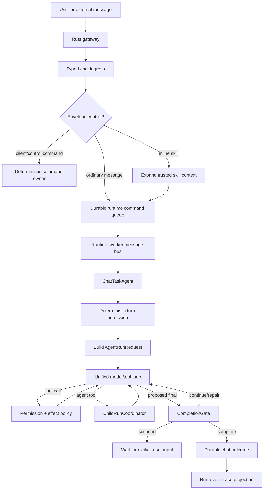

# Task-Agent Runtime Architecture

## Purpose

This document is the source of truth for Magi's current task-agent runtime. It
covers ordinary chat turns, headless/background execution, child runs, runtime
control, completion governance, reasoning policy, persistence, and read-side
projection.

The architecture is model-first but runtime-governed:

- the main model decides task semantics and the next useful action;
- deterministic code owns admission, permissions, effect policy, budgets,
  cancellation, persistence, completion requirements, and bounded recovery;
- ordinary user messages do not pass through a semantic intent-classifier LLM;
- chat, background, worker, and skill-backed work share one bounded run loop.

Last reviewed against the implementation: 2026-08-24.

## Core Decisions

1. **One model-facing loop.** A direct reply is simply a run whose first model
   step proposes a final response and passes the completion gate. It is not a
   separate execution mode or handler.
2. **No ordinary-turn semantic pre-router.** `ChatTurnAdmissionService` only
   separates user messages from non-user domain facts. `CapabilityResolver`
   builds an initial bounded capability surface deterministically.
3. **Code governs invariants, not task semantics.** Permissions, destructive
   controls, effect replay, validation requirements, budgets, and repair bounds
   are enforced by code. The model chooses whether to answer, call tools, update
   a plan, or launch child runs within those bounds.
4. **Plans are runtime state.** `RunPlan` is versioned and evidence-linked. The
   main model updates it through `todo_write`; the frontend reads a projection
   from canonical run events rather than a duplicate chat transcript message.
5. **Child agents are child runs.** The `agent` tool launches bounded runs via
   `ChildRunCoordinator`. There is no separate parent DAG orchestrator.
6. **Reasoning depth is a policy, not an inferred intent field.** The user picks
   `auto`, `fast`, or `deep`; the runtime may escalate monotonically from
   evidence such as failed validation, within a fixed budget.
7. **The run journal is the execution fact source.** Context manifests and
   ordered run events are durable. Chat trace summaries, plan state, metrics,
   validation, repair, and child-run status are read-side projections.

## System Topology

The desktop runtime is split across two Python roles behind the Rust gateway:

- **API process** — accepts product requests, owns chat ingress transactions,
  enqueues durable runtime commands, and serves chat/control/trace read APIs;
- **runtime worker** — consumes commands, runs task agents, owns the in-process
  message bus, executes model/tool loops, and writes runtime events and chat
  outcomes.

The message bus is process-local. SQLite queues and domain stores, not the bus,
own restart recovery.



## Bootstrap And Readiness

`bootstrap/` is the composition root. It wires layer-owned modules rather than
placing business logic in one global service bag. Startup follows four broad
phases:

1. infrastructure and database migrations;
2. stores, registries, model providers, tools, skills, and runtime bindings;
3. recovery workers, task-agent runtime, scheduler, channels, and business
   services;
4. exported bindings, maintenance dependencies, and readiness publication.

The current runtime-worker sequence in `bootstrap/runtime_worker_builder.py` is:

### Phase 1: infrastructure bring-up

1. `subprocess_orphan_cleanup`
2. `runtime_core_dependencies`
3. `runtime_initialization_state`
4. `runtime_memory_restore_recovery`
5. `runtime_database_migrations`
6. `runtime_identity`
7. `runtime_configuration`
8. `runtime_command_queue`
9. `runtime_message_bus`
10. `runtime_chat_store`
11. `runtime_plugin_system`
12. `runtime_llm`

### Phase 2: stateful services and read/write stores

13. `runtime_memory`
14. `runtime_chat_forgetting_recovery`
15. `runtime_media_registry`
16. `runtime_location`
17. `runtime_manual_entries`
18. `runtime_history_imports`
19. `runtime_memory_ingestion_subscriber`
20. `runtime_llm_usage_subscriber`
21. `runtime_chat_projector`
22. `runtime_chat_assistant_memory_projection`
23. `runtime_control_transcript_subscriber`
24. `runtime_trace`
25. `runtime_trace_subscriber`
26. `runtime_hooks`
27. `runtime_first_party_tools`
28. `runtime_tools`
29. `runtime_skills`
30. `runtime_mcp`
31. `runtime_personality`
32. `runtime_sensor_hub`
33. `runtime_context`
34. `runtime_agent_core`

### Phase 3: long-running processors and business services

35. `runtime_chat_delivery_recovery`
36. `runtime_command_processor`
37. `runtime_plugin_ingress_processor`
38. `runtime_timeline`
39. `runtime_timeline_subscriber`
40. `runtime_kg_subscriber`
41. `runtime_sensor_state_subscriber`
42. `runtime_scheduler`
43. `runtime_agent_schedule_registration`
44. `runtime_sensor_scheduler`

### Phase 4: exports and maintenance registration

45. `runtime_exports`
46. `runtime_control_plane`
47. `runtime_l1_maintenance_scheduler`
48. `runtime_l2_maintenance_scheduler`
49. `runtime_l2_consolidation_scheduler`
50. `runtime_l2_derive_scheduler`
51. `runtime_l3_summary_scheduler`
52. `runtime_l3_maintenance_scheduler`
53. `runtime_l4_maintenance_scheduler`
54. `runtime_timeline_schedulers`
55. `runtime_operational_gc_scheduler`
56. `runtime_other_dependencies`
57. `runtime_channels`
58. `runtime_outreach`
59. `runtime_scheduler_activation`
60. `runtime_sensor_sync_executor`

Important rule: bootstrap order is dependency order, not ownership order. The
scheduler engine is infrastructure even though it starts after services that
register schedules into it. It remains paused until
`runtime_scheduler_activation`; unchanged registrations are read-only.

The product readiness states remain:

- `ready` — normal agent execution is available;
- `deferred` — configuration/onboarding may proceed, but full model execution is
  not yet guaranteed;
- `degraded` — startup completed with an explicitly reduced capability set;
- `unresponsive` — the IPC worker did not answer the bounded readiness probe.

Full-clear recovery is completed before ordinary runtime commands are admitted.
This prevents pre-clear queue rows, projections, or plugin ingress from
recreating deleted user content.

## Ingress Envelope And Slash Commands

The client sends structured fields for controls that must not be guessed from
natural language:

- reasoning preference (`auto`, `fast`, `deep`);
- inline skill identity and expanded content hash;
- reply target and managed attachments;
- controlled interaction responses;
- workspace and source-channel identity.

Slash recognition is owned before the model-facing run:

- `CommandRegistry` is the canonical catalog for client, control, tool, and
  skill commands;
- client/control commands such as `/cancel`, `/clear`, `/fast`, and `/deep` are
  handled deterministically by their declared owner;
- user-invocable tool commands execute through `CommandRunner`, including the
  same permission boundary used by model-driven calls;
- inline skills are expanded by the backend and become typed, trusted context in
  `UserMessagePayload.skill_invocation`; their allowed tools are pinned into the
  initial capability view;
- a slash-like string not resolved by the command catalog remains ordinary user
  text. The model may interpret its meaning, but cannot turn it into a privileged
  command.

Every command invocation/result written to chat uses the chat-owned surface
writer. Commands do not assemble transcript rows directly.

## Deterministic Turn Admission

The generic `TaskAgent` pipeline still exposes hooks named `match_intent` and
`match_tools`, but their current chat implementations are not semantic LLM
routers:

- `ChatFactClassifier` normalizes fact envelopes into `USER_MESSAGE` or
  `OTHER_FACT` and extracts typed payloads;
- `ChatTurnAdmissionService` routes non-user facts to `ExecutionMode.FACT_ONLY`;
- every ordinary user message returns the `unified_agent_run` admission with no
  route-derived execution mode;
- `ExecutionMode` therefore describes only deterministic domain-event handling,
  not chat/code/explore/orchestration model paths.

This distinction is intentional. Removing the pre-router does not mean removing
typed ingress or validation. It removes an extra semantic prediction whose
output previously duplicated decisions the main model had to make again.

## Initial Capability Resolution

`CapabilityResolver` constructs a bounded, auditable initial tool surface before
the first model call. Its inputs are deterministic or retrieval-based:

- resident system tools;
- tools explicitly granted by an inline skill;
- attachment resolver tools required by current/replied-to assets;
- a bounded continuity pin for a recent failed tool;
- Top-K metadata search over the live tool/skill registry;
- model support for tool calling, feature flags, registrations, and effect
  metadata.

L4 advisories may rerank optional candidates but cannot authorize a disabled
tool or displace resident/pinned capabilities. A local-write or unknown-effect
candidate also causes `verify` to be exposed when available.

If the first surface is insufficient, the model may use the bounded discovery
tool during the loop. The runtime appends only admitted capabilities and records
`CAPABILITIES_EXPANDED`; it does not restart semantic routing.

## `AgentRunRequest`

`backend/src/magi/agent/execution/function_calling/run_input.py` defines the
single model-facing request contract. It carries:

- typed `UserTurnInput`, effective system prompt, history, summary, reply and
  ephemeral context;
- selected tools and a snapshot of capability resolution;
- user/session/turn/run/parent-run identity;
- execution preset, workspace, model capabilities, timeout, and task bounds;
- `ReasoningPolicy` and current `ReasoningState`;
- `CompletionPolicy` and a provider for the current versioned `RunPlan`;
- `RunControl`, checkpoint, and context-source snapshots.

`AgentRunRequest.headless(...)` is used by background and child execution. It
cannot smuggle chat presentation services into the engine. Chat-specific prompt
assembly and outcome projection stay in the chat driver.

## Unified Agent Loop

`AgentRunHandler` prepares the request. `FunctionCallingOrchestrator` and
`FunctionCallingLoopRunner` execute it. One logical iteration is:

```text
safe-boundary control/input drain
  -> resolve effective reasoning depth
  -> model call with current capabilities
  -> if tool calls: permission/effect admission -> execute -> record evidence
  -> if child launch: execute bounded child run(s) -> return structured results
  -> if proposed final: evaluate CompletionGate
       complete  -> finish
       continue  -> append repair observations and iterate
       suspend   -> checkpoint and wait for explicit interaction
       blocked   -> finish with a governed blocked outcome
```

The runtime owns maximum iterations, model/worker reservations, timeouts,
permission waits, effect identities, repair bounds, context compaction, and
cancellation checks. The model owns semantic decomposition and the choice of
next action within the exposed capabilities.

There is no `DirectLLMHandler`, `TaskOrchestrator`, `ExploreTaskAgent`, route
graph, or route-derived handler registry for ordinary turns. A simple chat still
costs one main model call because it naturally takes the shortest path through
the same loop.

## Tool Effects And Replay

Every executable tool is normalized through canonical effect metadata:

- effect class: `read_only`, `local_write`, `external_write`, or `unknown`;
- replay policy and semantic effect identity;
- permission/risk metadata;
- whether uncertain outcomes must be reconciled.

The invocation service records effect attempts before calling effectful tools.
An ambiguous or uncertain attempt is not automatically replayed. Provider-level
idempotency is still required for remote systems; a local ledger cannot make a
remote transaction atomic.

Tool results become `ToolExecutionEvidence`. The completion gate consumes this
normalized evidence instead of trusting a model claim that work succeeded.

## Completion Gate And Repair

`CompletionGate` is deterministic. It evaluates a proposed final response using
the run's policy, tool evidence, current plan, pending interaction state, and
repair count.

It enforces these current invariants:

- a pending required interaction suspends the run;
- an uncertain effect blocks completion until reconciled;
- every required plan item must be terminal and completed items must cite
  evidence from the current run;
- failed validation must be followed by a successful validation after repair;
- local-write and unknown-effect work must have current validation evidence;
- repair cannot exceed the configured budget.

Gate rejection is not a hidden fixed workflow such as “always plan, then act,
then validate.” Simple conversation skips plans, tools, and validation. The
runtime adds those constraints only when observed effects, an explicit plan, or
evidence make them necessary.

## Reasoning Depth Policy

Reasoning depth has four layers of ownership:

1. **Explicit preference.** `auto`, `fast`, or `deep` enters through the typed
   message envelope or the corresponding slash control.
2. **Preset baseline.** Chat/background/child presets select an initial depth,
   maximum depth, and escalation budget.
3. **Model/provider clamp.** `ModelCapabilityProfile` maps the requested depth to
   what the active provider/model can actually support.
4. **Evidence-driven escalation.** Validation failure or another completion
   rejection marked `reasoning_helpful` may raise the next step monotonically.

`ReasoningState` is checkpointed. Escalation cannot lower depth, exceed the run
maximum, or reset its counter on retry. A validation-required rejection caused
only by missing evidence does not automatically buy more reasoning.

Operationally, ordinary `auto` chat starts at low depth without a router call;
`fast` starts at none and is capped at low; `deep` starts at medium and may reach
max where the provider supports it.

## Versioned Run Plans

The model uses `todo_write` when a user-visible plan materially helps execution.
The runtime owns plan ID, version, transition validation, and optimistic
concurrency. Plan items may be patched rather than replacing the whole plan.

Important invariants:

- at most one item is `in_progress`;
- completed required items cite current-run evidence;
- blocked items carry a reason;
- cancellation marks the run-owned active plan cancelled;
- the completion gate reads the current `RunPlan`, not model prose.

A successful `todo_write` produces `PLAN_UPDATED` in the run journal. The trace
projection exposes the latest plan to the frontend. The retired `todo_state`
chat message and `/control/.../todos` duplicate read API no longer exist. The
workspace cache stores file-read, edit-journal, and rollback-snapshot evidence
only; it has no plan or todo model, so a restart cannot create a second plan
truth outside the run journal.

## Child Runs

The parent model decides whether decomposition is useful by calling the `agent`
tool. `ChildRunCoordinator` owns the mechanics:

- `launch`, `status`, `await`, and `cancel` actions;
- single or batch children, optionally parallel;
- parent/child identity and run-revision ownership;
- shared task-level model/worker budgets;
- bounded iteration/await timeouts;
- cancellation propagation and structured result validation.

Presets are capability policies, not semantic task classes:

- `read_only` — read-only tools, low baseline reasoning;
- `workspace_write` — read plus local-write tools, medium baseline reasoning;
- `review` — read-only review surface, medium baseline reasoning;
- `default` — conservative read-only fallback.

Children execute the same unified loop through `AgentRunRequest.headless`. They
cannot recursively launch `agent`, update the parent plan, ask the user, or
detach themselves. Their allowed tools are derived from effect metadata, and
their reasoning ceiling cannot exceed the parent's policy or remaining budget.

## Active-Run Input, Cancellation, And Detach

`SessionRunCoordinator` owns one active foreground run per chat session.

Ordinary text received while that run is active is persisted as another user
turn and attached to the run with the single disposition `message`.
`RunInputQueue` drains it exactly once at the next safe model-step boundary and
adds a typed `RunInputMessage` to context. The old AUGMENT/STEER/DEFER semantic
classifier and its extra LLM call are retired.

Structured interactions that must start a new root turn remain separate from
in-flight text injection. They are not flattened into arbitrary user prose.

Cancellation has two explicit paths:

- structured `/cancel` or UI cancellation;
- a narrow exact-phrase fallback checked by `cancel_protocol.py` against the
  managed phrase list.

The fallback accepts only an unambiguous whole-message cancel protocol; it does
not semantically classify normal text. Durable turn cancellation and active-run
cancellation share the same ownership boundary, so cancellation can win before
admission or stop the exact already-created run. Tools, child launches, model
steps, and final delivery recheck the cancel token at side-effect boundaries.

Detach transfers eligible foreground work into the background runtime through a
typed control/tool path. The background task receives the trigger, remaining
budget, context snapshot, and cancellation ownership explicitly; detach is not
inferred from arbitrary prose.

## Persona Boundary

Persona planning receives task/runtime signals but does not own execution
routing. It classifies conversational register and applies hard safety/quiet
clamps inside `PersonaTurnPlanner`. The persona plan influences prompt voice,
not capability authorization, completion, or effect policy.

There is no dependency on a `ContextDecider` hint. Persona behavior must remain
correct for ordinary chat, technical analysis, tool work, emotional support,
and safety cases using the typed turn/context signals available at prompt
assembly.

## Durable Run Journal And Trace Projection

`runtime_trace.db` contains:

- `agent_run_manifests` — insert-once prompt, message, tool-schema, and
  context-source fingerprints plus non-content provenance;
- `agent_run_events` — ordered lifecycle facts;
- `run_plans` — versioned plan snapshots;
- normalized spans/tool/model rows for lower-level tracing;
- runtime notifications and plugin ingress records.

Important run events include model output, tool request/result/effect admission,
capability expansion, plan update, child lifecycle, validation, completion
decision, repair, reasoning-depth change, suspension, completion, failure, and
cancellation.

`ChatTraceReadService` prefers canonical run events when they exist and falls
back to normalized trace rows only for non-unified producers. The run-event
projection is the source for:

- current plan summary;
- child, validation, repair, and reasoning nodes;
- run status and duration;
- model/tool/validation/repair/child counts;
- first-action and total runtime latency;
- token totals and reasoning escalation count.

The journal is an observability source, not a second prompt archive. Manifests
and `CONTEXT_PREPARED` events never copy system prompts, conversation messages,
rendered memory/persona/skill context, tool schemas, or attachment bytes. They
store deterministic digests, encoded sizes, counts, and stable source IDs. The
live loop and an explicitly persisted background handoff checkpoint may retain
the model-facing context required to continue execution; chat forgetting removes
the checkpoint through its origin-turn ownership boundary.

Chat transcript truth remains in `chat.db`. Execution plans and intermediate
runtime state are not duplicated as chat messages. Runtime notifications are
best-effort wakeups; reload always reconstructs from durable stores.

## Persistence Boundaries

- `chat.db` — sessions, turns, visible messages, attachments, reply/label state,
  accepted-turn delivery ledger, rolling summaries, and projection intents;
- `runtime_trace.db` — run manifests/events/plans, normalized execution traces,
  and live notification records;
- `message_queue.db` — durable command admission and delivery attempts;
- `background_tasks.db` — background specifications, attempts, effect ledger,
  completion intents, and budgets;
- memory databases — governed memory facts and lifecycle state, never the
  source of truth for active execution recovery;
- `scheduler.db` — schedules, target state, execution records, and sensor jobs.

The retired `orchestration_id` column has been removed from chat, trace, and
background current schemas. `run_id`, `parent_run_id`, turn identity, and task
identity are the only execution ownership seams.

## Prompt History And Context Capacity

Chat prompt assembly combines:

- the active rolling summary and complete unsummarized user-led tail;
- the current typed turn and reply target;
- managed attachment references;
- bounded recent tool-state continuity;
- memory retrieval and persona plan;
- explicit inline skill context;
- the current tool schemas only on calls that send tools.

Display-history pagination never defines model context. Under pressure,
compaction keeps complete protocol groups and preserves tool-call identifiers.
The active model's input/output limits determine the capacity decision.
Provider-facing prompt measurement is performed before every model call.

Session summaries are continuation checkpoints in `chat.db`, not long-term
memory facts. A summary or attachment metadata failure must not silently turn a
known conversation into an empty prompt.

## Background And Scheduled Execution

Background tasks, scheduled agent tasks, and child runs all call the unified
loop with explicit presets and durable budgets. Background completion is stored
before delivery fan-out so startup can resume pending completion intents without
rerunning the model task.

Scheduler targets own timing and enqueueing. The background runtime owns model
and tool execution. Successful user-facing results are projected back to the
originating chat as ordinary assistant outcomes while background rows remain
available for audit.

## Delivery, Recovery, And Privacy Boundaries

Chat acceptance is a single chat-domain transaction covering the session/turn,
first user message, attachment ownership, and initial delivery record. Runtime
queue admission is durable at-least-once; execution side effects are not
globally atomic with that queue.

The accepted final chat surface is idempotent by stable turn and delivery
attempt. A stale attempt cannot close or overwrite a newer run. Assistant memory
projection begins only after the visible outcome is durable.

Explicit deletion and full clear establish barriers before active work,
recovery workers, plugin ingress, projections, and memory writes may continue.
L0 does not persist active runs or pending run input. A missed in-process
post-turn analysis may be lost, but durable chat truth and run journals remain
recoverable.

External channel replies still occur after the durable chat commit without a
per-target durable egress outbox. A crash in that gap may preserve the desktop
answer while losing the external send; this path must not be described as
exactly-once delivery.

## Layer Ownership

- `agent/execution/` owns the unified run request, loop, journal, capability
  policy, reasoning state, effect evidence, completion gate, and checkpoints;
- `agent/workers/` owns bounded child-run mechanics and presets;
- `agent/task_agents/` owns generic task-agent hooks and handler contracts;
- `chat/task_agent/` owns chat context, session/run admission, safe-boundary
  input, presentation, post-processing, and transcript outcome policy;
- `commands/` and `skills/` own typed slash resolution and expansion;
- `control/` owns permissions, asks, plan state, run control, and user-content
  clear coordination;
- `runtime_trace/` owns durable execution observability and read projections;
- `bootstrap/` only composes these owners.

The agent layer must not import chat presentation or persistence implementations.
Chat supplies narrow protocols and constructs `AgentRunRequest`; the loop returns
a domain-neutral execution result.

## Cost And Latency Consequences

| Scenario | Current model calls | Runtime consequence |
| --- | --- | --- |
| Simple chat | one main call | no serial router latency |
| Ordinary tool task | main loop calls only | bounded metadata capability resolution is local |
| Inline skill | skill expansion plus main loop | no additional intent call |
| Child decomposition | parent calls plus child calls | fan-out occurs only when the parent requests it |
| Validation repair | additional main repair calls | paid only after observed evidence requires repair |
| `fast` / `deep` | same call count | changes reasoning effort/budget, not route shape |

The architecture removes one serial auxiliary LLM call from every ordinary
turn. It may spend extra calls when capability recovery, child work, or repair
is actually needed. Those costs are evidence-driven and visible in runtime
metrics.

## Files To Read First

- `backend/src/magi/chat/task_agent/turn_admission_service.py`
- `backend/src/magi/chat/task_agent/coordinator.py`
- `backend/src/magi/agent/execution/function_calling/run_input.py`
- `backend/src/magi/agent/execution/function_calling/loop_runner.py`
- `backend/src/magi/agent/execution/capability_resolver.py`
- `backend/src/magi/agent/execution/completion_gate.py`
- `backend/src/magi/agent/execution/reasoning.py`
- `backend/src/magi/agent/execution/journal.py`
- `backend/src/magi/agent/workers/worker_manager.py`
- `backend/src/magi/chat/task_agent/run_input_queue.py`
- `backend/src/magi/runtime_trace/chat_trace/run_event_projection.py`

## Contributor Rules

- Do not add a semantic pre-router for ordinary turns.
- Add a deterministic branch only for protocol, ownership, safety, permission,
  effect, budget, or persistence invariants.
- Do not create a second direct/chat/code/explore loop.
- Add capabilities through registry metadata and runtime resolution, not phrase
  dictionaries in the chat driver.
- Keep plans and intermediate execution state in the run journal/read
  projection, not the chat transcript.
- A child execution feature must use `ChildRunCoordinator` and the unified loop.
- Every new effectful tool must declare effect/replay metadata and have a
  validation story.
- Tests should prove the current contracts. Delete tests whose only purpose is
  to preserve retired routes, fields, or compatibility behavior.
