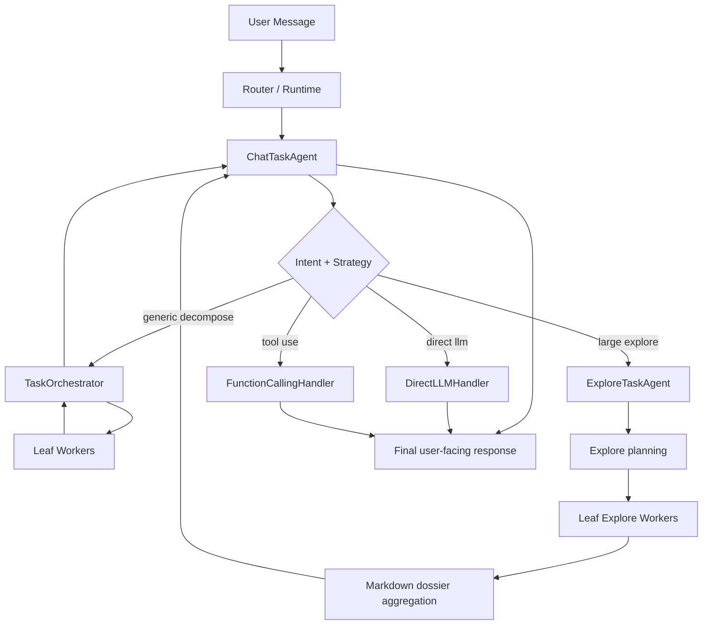

# Task-Agent Runtime Architecture

## Purpose

This document describes the current backend runtime architecture for task agents, orchestration, worker execution, and the internal typed contracts that connect them.

It is implementation-oriented and is meant for maintainers and contributors working on the runtime itself.

## Design Intent

The current runtime is built around three ideas:

- Keep user-facing task logic in task agents, not in workers
- Keep workers leaf-only and tightly scoped
- Use typed internal contracts for execution, orchestration, worker results, and internal fact payloads

## Main Runtime Flow

## Runtime Layers

### 1. `TaskAgent` base loop

The shared runtime loop lives in:

- [task_agent.py](/Users/asuka/code/magi/backend/src/magi/core/runtime/task_agent.py)

It now acts as a typed pipeline over five stages:

1. `build_context`
2. `match_intent`
3. `match_tools`
4. `assemble_llm_params`
5. `call_llm`
6. `parse_result`

The base class is generic over:

- runtime context
- intent result
- tool selection
- execution request
- execution result

This means specialized task agents can share one loop while keeping their own typed contracts.

### 2. `ChatTaskAgent`

Primary user-facing task agent:

- [chat_task_agent.py](/Users/asuka/code/magi/backend/src/magi/agent/task_agents/chat_task_agent.py)

Current responsibilities:

- Build chat runtime context
- Delegate execution routing to `ChatExecutionCoordinator`
- Own chat-specific prompt/session/postprocess services
- Render final user-facing answers

It should not directly own detailed orchestration logic anymore.

### 3. `ExploreTaskAgent`

Specialized task agent for large exploration requests:

- [explore_task_agent.py](/Users/asuka/code/magi/backend/src/magi/agent/task_agents/explore_task_agent.py)

Current responsibilities:

- Accept large exploration requests from chat
- Plan bounded explore subtasks
- Delegate worker orchestration to `TaskOrchestrator`
- Aggregate completed worker results into a Markdown dossier
- Send the dossier back upstream to `ChatTaskAgent`

### 4. `TaskOrchestrator`

Shared parent-task orchestrator:

- [task_orchestrator.py](/Users/asuka/code/magi/backend/src/magi/agent/task_orchestrator.py)

Current responsibilities:

- Start a parent orchestration
- Persist orchestration state
- Launch leaf workers
- Process worker progress/completion/failure updates
- Apply retry policy
- Trigger final aggregation when all subtasks reach a terminal state

This is the main shared orchestration state machine for task agents.

### 5. `WorkerAgentManager`

Leaf worker lifecycle manager:

- [worker_manager.py](/Users/asuka/code/magi/backend/src/magi/agent/workers/worker_manager.py)

Current responsibilities:

- Launch workers of specific types
- Restrict available tools by worker type
- Enforce worker result schema
- Publish worker progress/completion/failure facts
- Persist full worker results for parent-task recovery

Workers remain leaf executors and do not recursively create new workers.

### 6. `SchedulerService`

Persistent business-task scheduling now lives in:

- [service.py](/Users/asuka/code/magi/backend/src/magi/scheduler/service.py)
- [bootstrap.py](/Users/asuka/code/magi/backend/src/magi/scheduler/bootstrap.py)

Current responsibilities:

- Persist one-shot, interval, and cron-style schedules to a local SQLite-backed store
- Restore recurring jobs on runtime startup
- Track per-target runtime state such as `last_success_at`, `last_error`, cursor, and watermark
- Dispatch scheduled work into runtime-owned handlers instead of scattered module-specific loops

This scheduler is meant for user-facing or business-facing runtime work, not system housekeeping. `MaintenanceDaemon` remains a separate mechanism for now.

## Current Task-Agent Execution Framework

The shared execution framework lives under:

- [common/](/Users/asuka/code/magi/backend/src/magi/agent/task_agents/common/)

The most important pieces are:

- [contracts.py](/Users/asuka/code/magi/backend/src/magi/agent/task_agents/common/contracts.py)
- [handlers.py](/Users/asuka/code/magi/backend/src/magi/agent/task_agents/common/handlers.py)
- [llm_service.py](/Users/asuka/code/magi/backend/src/magi/agent/task_agents/common/llm_service.py)

### Execution mode

Execution is routed by `ExecutionMode`:

- `FACT_ONLY`
- `DIRECT_LLM`
- `FUNCTION_CALLING`
- `ORCHESTRATION_LAUNCH`
- `ORCHESTRATION_UPDATE`
- `EXPLORE_TASK_RENDER`

### Request/handler model

Each execution mode is backed by a handler. The general pattern is:

1. Coordinator chooses an `ExecutionMode`
2. Coordinator creates an `ExecutionRequest`
3. Handler specializes it into a mode-specific request DTO
4. Handler executes and returns an `ExecutionResult`

### Why this matters

Before the refactor, these steps passed anonymous dictionaries and string modes across many methods.

Now the flow is much easier to reason about because:

- execution modes are explicit enums
- execution requests are typed DTOs
- handler boundaries are visible
- chat and explore task agents follow the same runtime shape

## Typed Contract Families

There are now four main contract families.

### 1. Execution contracts

Defined in:

- [common/contracts.py](/Users/asuka/code/magi/backend/src/magi/agent/task_agents/common/contracts.py)

Examples:

- `ExecutionRequest`
- `DirectLLMRequest`
- `FunctionCallingRequest`
- `OrchestrationLaunchRequest`
- `OrchestrationUpdateRequest`
- `ExploreRenderRequest`
- `ExecutionResult`
- `FunctionCallingExecutionResult`

### 2. Runtime context and intent contracts

Base contracts:

- `BaseRuntimeContext`
- `BaseIntentDecision`

Specialized contracts:

- [chat/contracts.py](/Users/asuka/code/magi/backend/src/magi/agent/task_agents/chat/contracts.py)
- [explore/contracts.py](/Users/asuka/code/magi/backend/src/magi/agent/task_agents/explore/contracts.py)

Examples:

- `ChatRuntimeContext`
- `IntentDecision`
- `ExploreRuntimeContext`
- `ExploreIntentDecision`

### 3. Orchestration contracts

Defined in:

- [orchestration.py](/Users/asuka/code/magi/backend/src/magi/agent/orchestration.py)

Examples:

- `PlannedSubtask`
- `SubtaskPlan`
- `SubtaskDefinition`
- `TaskOrchestrationState`
- `OrchestrationExecutionResult`

### 4. Worker result contracts

Also defined in:

- [orchestration.py](/Users/asuka/code/magi/backend/src/magi/agent/orchestration.py)

Examples:

- `WorkerResult`
- `WorkerFinding`
- `WorkerEvidence`

These are now typed all the way through worker validation, orchestration storage, aggregation, and prompt fallbacks.

## Internal Fact Payloads

One of the biggest recent changes is that internal fact payloads are now typed after ingestion.

The external transport is still:

- `FactRecord.payload: dict[str, Any]`

But once a task agent classifies an incoming fact, the payload becomes a typed domain object.

Key payload DTOs:

- `UserMessagePayload`
- `WorkerUpdatePayload`
- `ExploreTaskRequestPayload`
- `ExploreTaskCompletedPayload`
- `GenericFactPayload`

## Unified Scheduler Targets

The scheduler runtime currently supports three target families:

- `timeline_sensor_sync`
  Pull-capable timeline sensors can collect source items on demand or on a recurring schedule, then normalize them through the existing timeline service

- `agent_task`
  The runtime can enqueue future work directly into a task agent without inventing a separate loop per feature

- `action_dispatch`
  Outbound actions can be delayed or repeated through the same scheduler contract while still remaining distinct from tools

This keeps timer-based work attached to the runtime boundary rather than coupling it to individual domains.

## Timeline Pull Sync Flow

Timeline sensors may now expose an optional pull-sync contract:

- [sync.py](/Users/asuka/code/magi/backend/src/magi/timeline/sync.py)

The runtime flow is:

1. Scheduler fires a `timeline_sensor_sync` target
2. `SchedulerBootstrap` resolves the sensor from `SensorRegistry`
3. A pull-capable sensor runs `collect_items(...)`
4. Returned items are normalized through `build_timeline_event(...)` and `extract_candidates(...)`
5. `TimelineService` writes L1 events and updates downstream relationship extraction

This is the path that enables plugin-backed local sources such as browser history collectors to participate in timeline ingestion without adding custom background loops for each source.

This lets internal code stop depending on large numbers of `payload.get(...)` calls.

## Important Boundary Rule

Use this rule when adding new functionality:

- At transport boundaries, dicts are acceptable
  Examples: persisted JSON, tool payloads, event bus payloads, API payloads

- Inside runtime domain logic, prefer typed DTOs
  Examples: execution requests, worker results, orchestration plans, classified fact payloads

This is the core boundary discipline that keeps the runtime maintainable.

## Explore Request Path

For a large codebase exploration request, the path is:

1. `ChatTaskAgent` receives a user fact
2. `ChatExecutionCoordinator` decides the request should decompose
3. Chat routes the request to `ExploreTaskAgent`
4. `ExploreTaskAgent` builds a `SubtaskPlan`
5. `TaskOrchestrator` launches leaf Explore workers
6. Workers return typed `WorkerResult`
7. `ExploreAggregationService` builds a Markdown dossier
8. `ExploreTaskAgent` emits an `ExploreTaskCompletedPayload`
9. `ChatTaskAgent` renders the final user-facing response

## Files To Read First

If you are modifying this part of the system, read these first:

- [task_agent.py](/Users/asuka/code/magi/backend/src/magi/core/runtime/task_agent.py)
- [chat_task_agent.py](/Users/asuka/code/magi/backend/src/magi/agent/task_agents/chat_task_agent.py)
- [explore_task_agent.py](/Users/asuka/code/magi/backend/src/magi/agent/task_agents/explore_task_agent.py)
- [task_orchestrator.py](/Users/asuka/code/magi/backend/src/magi/agent/task_orchestrator.py)
- [orchestration.py](/Users/asuka/code/magi/backend/src/magi/agent/orchestration.py)
- [worker_manager.py](/Users/asuka/code/magi/backend/src/magi/agent/workers/worker_manager.py)

## Current Strengths

- Chat and explore task agents now share the same execution skeleton
- Workers are leaf-only and bounded
- Internal contracts are much more explicit than before
- The runtime can now be reasoned about in terms of stable DTOs instead of ad hoc payload dictionaries

## Current Risks

- [common/contracts.py](/Users/asuka/code/magi/backend/src/magi/agent/task_agents/common/contracts.py) is growing and may need to be split by concern
- `TaskOrchestrator` is still a dense class and may eventually need event-adapter separation
- Event transport payloads are still dict-based externally, so contract drift is still possible if new event producers bypass the typed classifiers

## Contributor Guidance

When adding a new runtime feature:

1. Decide whether it belongs to chat, explore, worker, or shared orchestration.
2. Prefer adding a typed contract before adding a new raw payload field.
3. If a new internal event is introduced, add a payload DTO and update the relevant classifier.
4. Keep workers leaf-only unless the architecture deliberately changes.
5. Keep user-facing rendering in task agents, not in workers.

When in doubt, prefer:

- typed DTO inside the runtime
- serialized dict only at the process or storage edge
